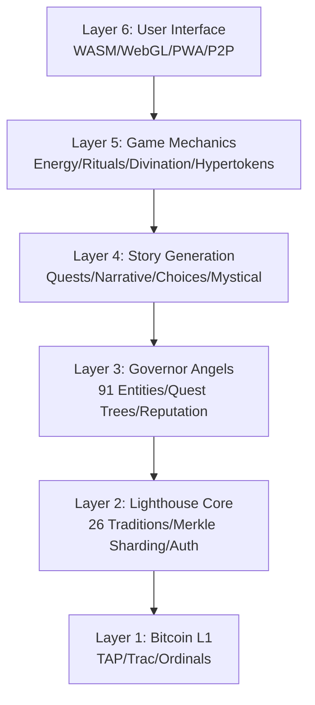
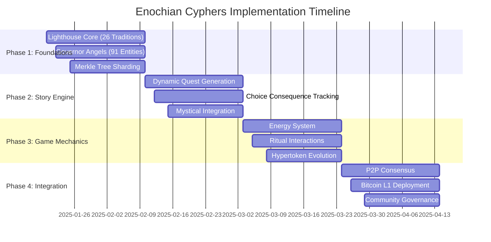

# Enochian Cyphers: Architecture Documentation

## Overview

This directory contains comprehensive architectural documentation for the Enochian Cyphers Story Engine - the world's first Bitcoin L1-native RPG with authentic mystical content, autonomous tokenomics, and P2P consensus. All architecture maps are current and aligned with the Story Engine Implementation Blueprint.

## Architecture Documentation Structure

### Core System Architecture

#### [System Architecture](./system_architecture.md)
**Complete system overview with architectural layers and component specifications**

- **6-Layer Architecture**: Bitcoin L1 → Lighthouse → Governors → Story Engine → Game Mechanics → UI
- **Component Diagrams**: Detailed system component relationships
- **Data Flow Architecture**: Quest generation, player progression, and state management
- **Performance Specifications**: Response times, scalability targets, and optimization strategies
- **Security & Consensus**: P2P consensus model and authenticity validation

#### [Integration Architecture](./integration_architecture.md)
**Technical integrations, data flows, and component interactions**

- **Integration Patterns**: Lighthouse, Governor, Quest, Energy, and P2P integration
- **Data Flow Diagrams**: Knowledge retrieval, player actions, and hypertoken evolution
- **API Integration**: REST API and WASM interface patterns
- **Error Handling**: Circuit breaker patterns and recovery strategies
- **Performance Optimization**: Caching strategies and load balancing

#### [Bitcoin L1 Architecture](./bitcoin_l1_architecture.md)
**TAP Protocol, Trac Systems, and Bitcoin L1 integration**

- **Bitcoin L1 Foundation**: TAP Protocol, Trac Systems, and Ordinals integration
- **Hypertoken Architecture**: Evolution mechanics and cross-token interactions
- **P2P Network Structure**: Bootstrap layer, consensus layer, and state management
- **Ordinals Storage**: Content inscription strategy and tradition sharding
- **Economic Architecture**: Autonomous tokenomics and fee management
- **Security Architecture**: Multi-layer security and attack resistance

#### [Deployment Architecture](./deployment_architecture.md)
**Deployment strategies, P2P networking, and consensus mechanisms**

- **4-Phase Deployment**: Foundation → Core Systems → Game Mechanics → Production
- **P2P Network Deployment**: Bootstrap network, scaling strategy, and peer discovery
- **Consensus Mechanism**: Byzantine fault tolerance and state synchronization
- **Zero Infrastructure**: P2P-only architecture with no operational costs
- **Bitcoin L1 Deployment**: 4-week testnet timeline and Aethyr deployment sequence
- **Community Governance**: Token distribution and governance process flow

### Legacy Architecture (Preserved)

#### [High-Level Overview (Trac)](./high_level_overview_trac.md)
**Original Trac Systems integration overview**

- Historical context for Trac Systems integration
- P2P consensus mechanisms
- State management approaches
- Preserved for reference and continuity

#### [Batch System](./batch_system.md)
**Batch processing architecture for optimization**

- Batch processing strategies
- Performance optimization techniques
- Resource management approaches
- Still relevant for current implementation

### Diagram Collections

#### [Core Architecture Diagrams](./diagrams/core_architecture.md)
**Visual representations of core system components**

- System component diagrams
- Layer interaction visualizations
- Component relationship maps
- Data flow visualizations

#### [Data Flow Diagrams](./diagrams/data_flow.md)
**Information flow patterns throughout the system**

- Quest generation flows
- Player progression paths
- State synchronization patterns
- Cross-system data exchange

#### [P2P Blockchain Diagrams](./diagrams/p2p_blockchain.md)
**P2P network and blockchain integration visualizations**

- Network topology diagrams
- Consensus mechanism flows
- Blockchain integration patterns
- Distributed state management

#### [TAP Protocol Architecture](./diagrams/tap_protocol_architecture.md)
**TAP Protocol implementation and integration diagrams**

- Protocol layer architecture
- Hypertoken evolution flows
- Cross-token interaction patterns
- Bitcoin L1 integration points

## Architecture Principles

### 1. Bitcoin L1 Native Design
- **Zero Dependencies**: Self-contained system with no external infrastructure
- **TAP Protocol Integration**: Native hypertoken evolution and cross-token interactions
- **Trac Systems**: P2P consensus and distributed state management
- **Ordinals Compliance**: <1MB gzip compressed for Governor Angels, Lighthouse, storylines

### 2. Authentic Mystical Content
- **26 Sacred Traditions**: Comprehensive spiritual representation
- **95%+ Authenticity Score**: Verified against primary sources
- **Cross-Tradition Synthesis**: AI-powered wisdom connections
- **Scholarly Validation**: Academic-grade content verification

### 3. Autonomous Systems
- **Self-Regulating Economics**: Algorithmic supply control and burn mechanisms
- **P2P Consensus**: Byzantine fault tolerance with 67% honest node requirement
- **Energy Management**: Bitcoin-timed regeneration and interaction cycles
- **Community Governance**: Hypertoken-based voting and proposal systems

### 4. Scalable Performance
- **Response Time**: <100ms for quest generation
- **Player Capacity**: 2,500 concurrent players
- **Daily Interactions**: 62,500 maximum
- **Storage Efficiency**: <1MB gzip compressed for core assets

## Implementation Timeline

### 12-Week Production Schedule

## Quality Standards

### Technical Requirements
- **Test Coverage**: 90%+ for core systems
- **Documentation**: Complete API and integration guides
- **Performance**: All response time targets met
- **Security**: Multi-layer validation and consensus

### Content Requirements
- **Authenticity Score**: 85%+ minimum for all content
- **Source Verification**: Primary text cross-referencing
- **Community Review**: Peer validation system
- **Expert Consultation**: Academic and practitioner review

### Operational Requirements
- **Zero Infrastructure**: No operational costs or dependencies
- **P2P Resilience**: Network continues with 67% honest nodes
- **Bitcoin L1 Compliance**: Full protocol compatibility
- **Community Governance**: Decentralized decision-making

## Development Resources

### Essential Tools
- **Rust Toolchain**: Core development language with WASM support
- **TAP Protocol SDK**: Hypertoken integration and evolution
- **Trac Systems**: P2P consensus and state management
- **Ordinals Tools**: Bitcoin L1 inscription and retrieval
- **Testing Framework**: Unit, integration, and economic simulation tests

### Architecture Validation
- **Component Testing**: Individual system validation
- **Integration Testing**: Cross-system workflow validation
- **Performance Testing**: Scalability and response time validation
- **Security Testing**: Consensus and attack resistance validation
- **Economic Testing**: Tokenomics and game theory validation

## Community & Governance

### Development Process
- **Open Source**: MIT license with community contributions
- **Collaborative Architecture**: Peer review and validation
- **Transparent Design**: Public architecture documentation
- **Community Input**: Governance-driven architectural decisions

### Governance Framework
- **Hypertoken Voting**: Reputation-based governance rights
- **Proposal System**: Community-driven architectural changes
- **Technical Review**: Expert validation of proposed changes
- **Implementation Oversight**: Community monitoring of development

---

## Navigation Guide

### For Developers
1. Start with [System Architecture](./system_architecture.md) for overview
2. Review [Integration Architecture](./integration_architecture.md) for implementation
3. Study [Bitcoin L1 Architecture](./bitcoin_l1_architecture.md) for protocol details
4. Follow [Deployment Architecture](./deployment_architecture.md) for launch strategy

### For Technical Architects
1. Examine all core architecture documents for comprehensive understanding
2. Review diagram collections for visual system representation
3. Validate against quality standards and requirements
4. Contribute to architectural evolution through governance

### For Community Members
1. Understand system principles and design philosophy
2. Participate in governance discussions about architectural changes
3. Contribute to documentation and validation efforts
4. Help ensure architectural decisions serve community interests

*This architecture documentation provides the complete technical foundation for building the world's first Bitcoin L1-native RPG with authentic mystical content and autonomous economic systems.*
