# Bitcoin L1 Architecture

## Overview

This document details the Bitcoin Layer 1 integration architecture for Enochian Cyphers, including TAP Protocol implementation, Trac Systems integration, and Ordinals-based storage. The system operates entirely on Bitcoin's base layer without sidechains or Layer 2 solutions.

## Bitcoin L1 Foundation Architecture

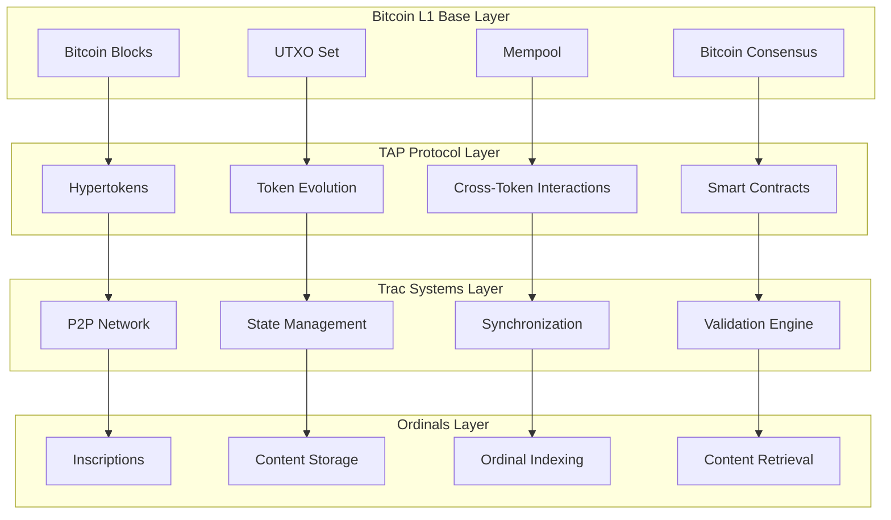

## TAP Protocol Integration

### Hypertoken Architecture

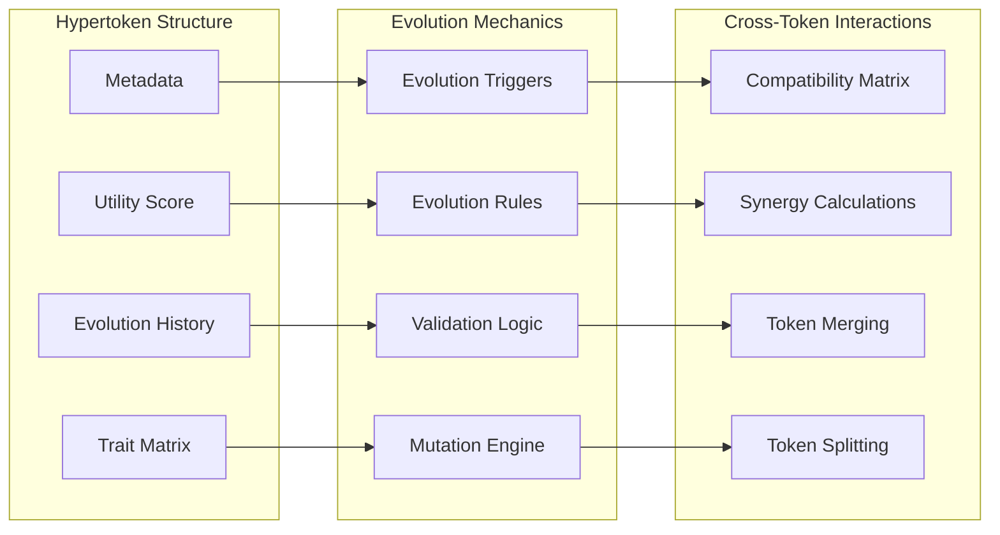

### TAP Protocol Transaction Flow

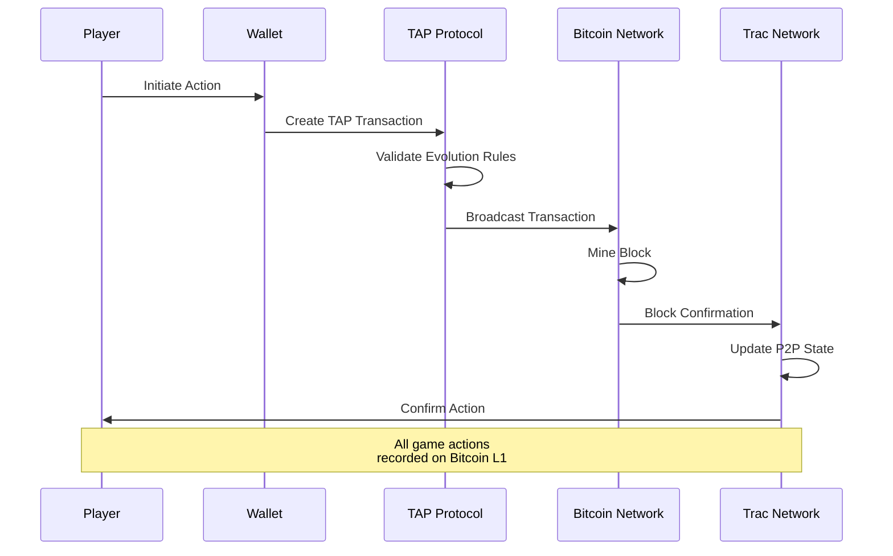

### Hypertoken Evolution Process

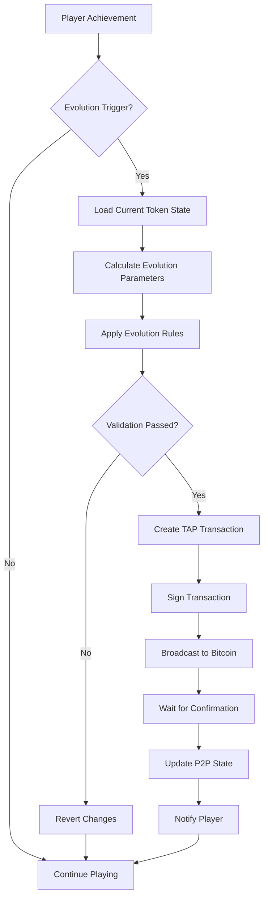

## Trac Systems Architecture

### P2P Network Structure

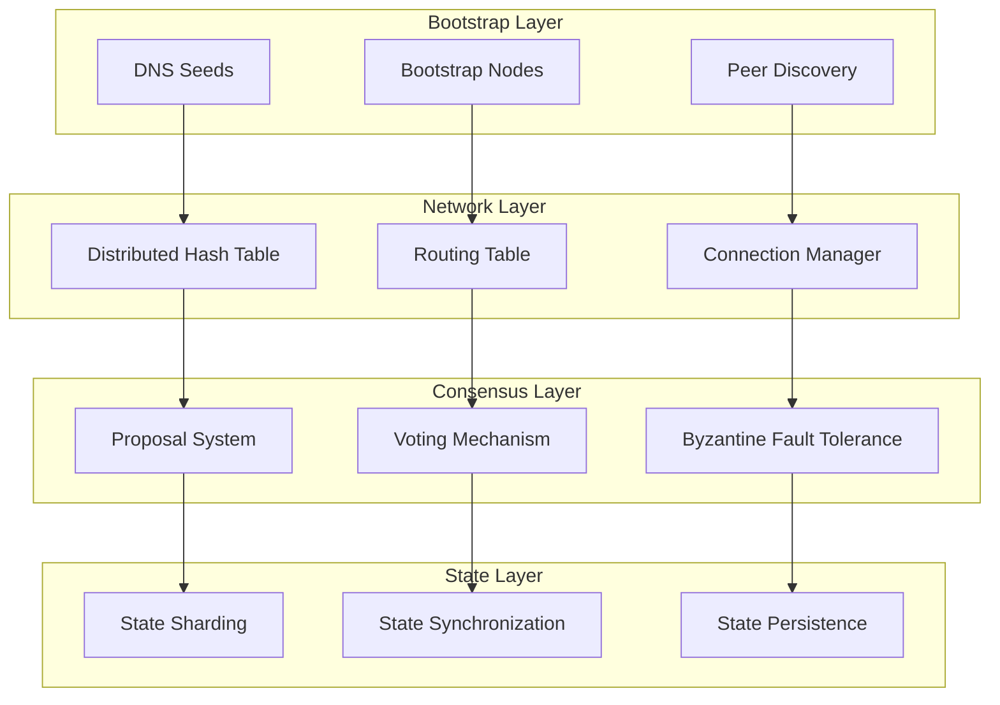

### Consensus Mechanism

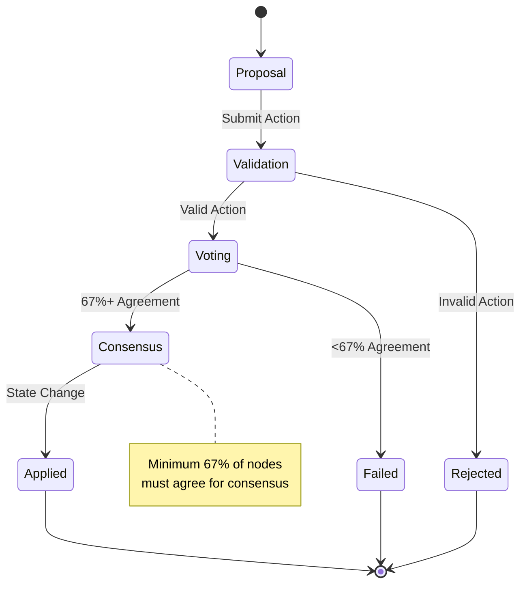

### State Synchronization

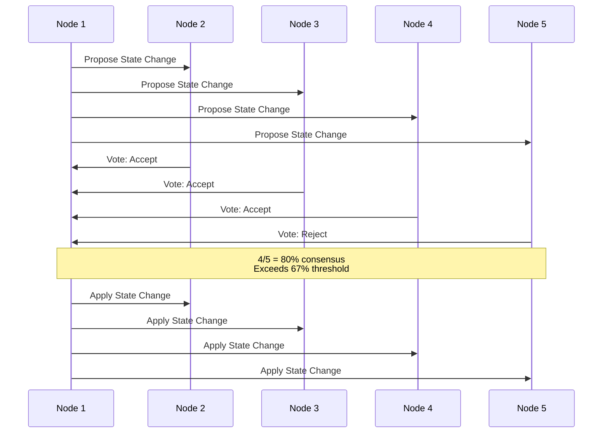

## Ordinals Storage Architecture

### Content Inscription Strategy

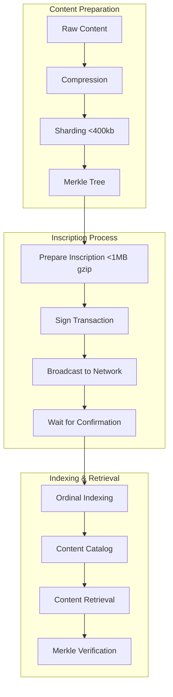

### Tradition Sharding Strategy

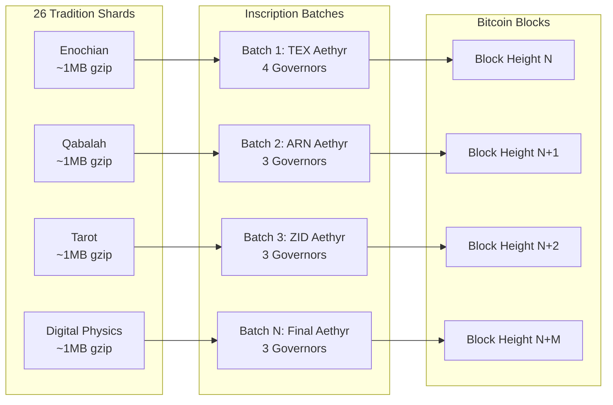

## Economic Architecture

### Autonomous Tokenomics

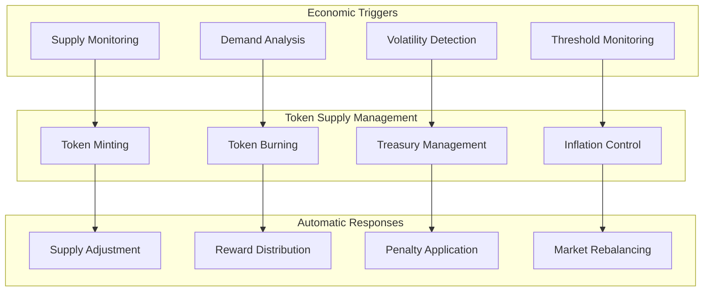

### Fee Management Strategy

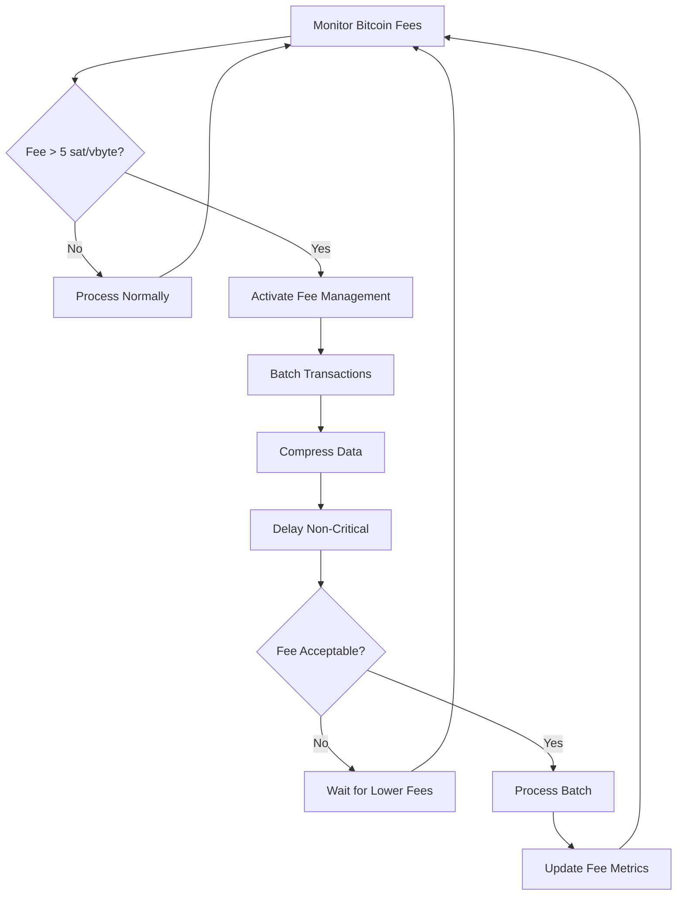

## Deployment Architecture

### 4-Week Testnet Strategy

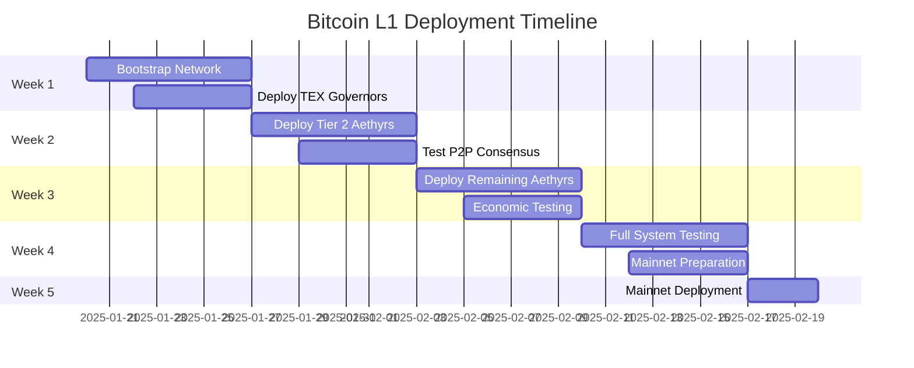

### Network Bootstrap Process

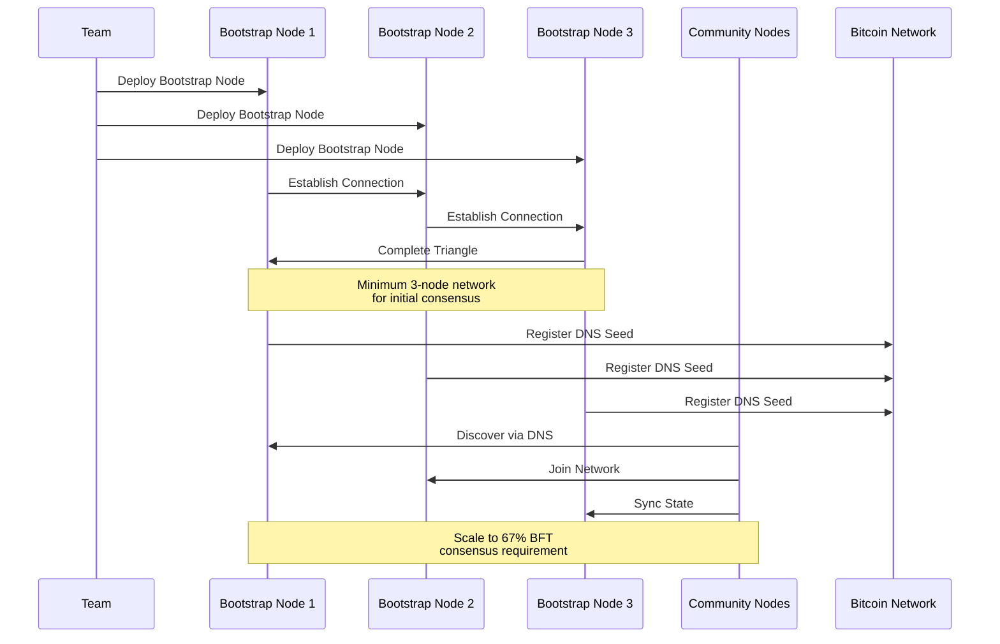

## Security Architecture

### Multi-Layer Security

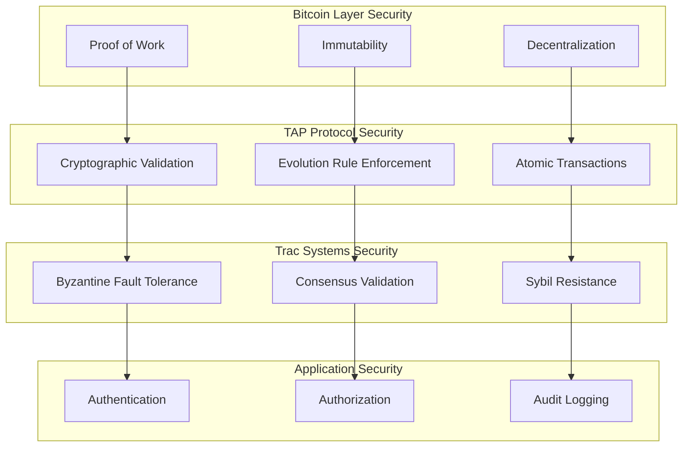

### Attack Resistance

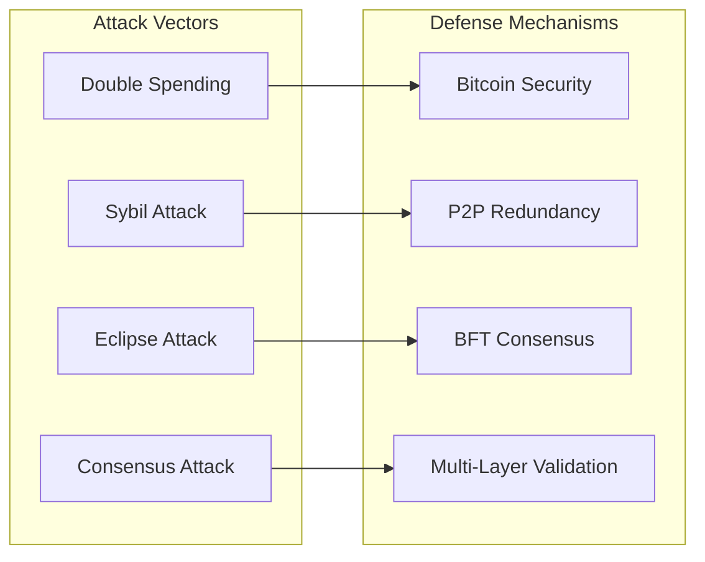

---

*This Bitcoin L1 architecture provides the complete foundation for a truly decentralized RPG operating entirely on Bitcoin's base layer, ensuring permanence, security, and autonomous operation.*
