# Deployment Architecture

## Overview

This document outlines the comprehensive deployment strategy for Enochian Cyphers, including P2P network deployment, consensus mechanisms, infrastructure requirements, and operational procedures for a fully decentralized Bitcoin L1-native RPG.

## Deployment Strategy Overview

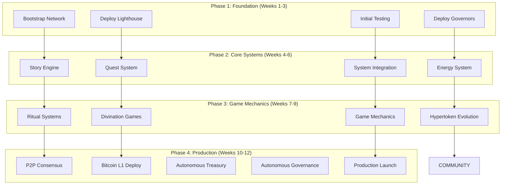

## P2P Network Deployment

### Bootstrap Network Architecture

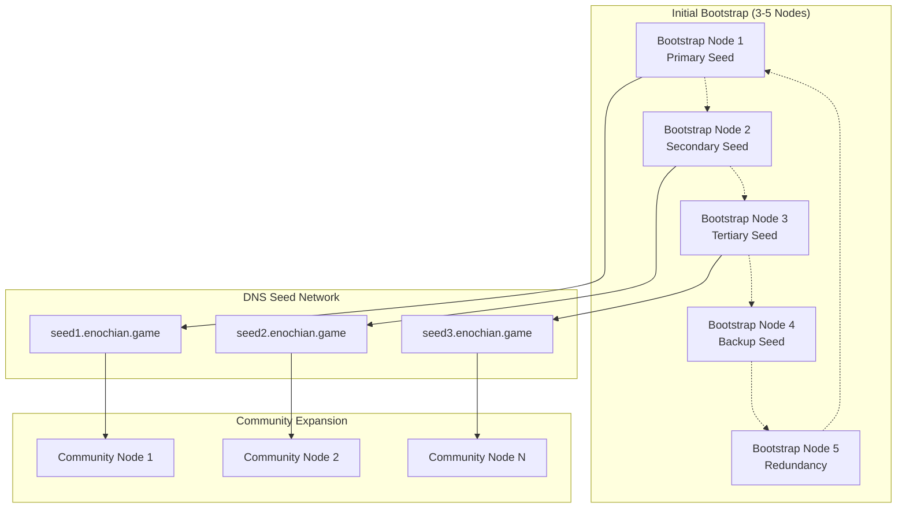

### Network Scaling Strategy

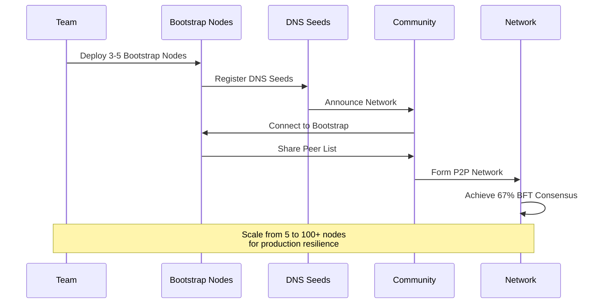

### Peer Discovery Mechanism

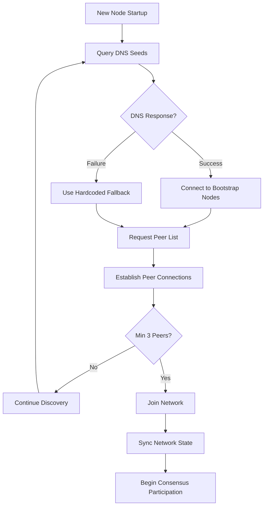

## Consensus Mechanism Deployment

### Byzantine Fault Tolerance Implementation

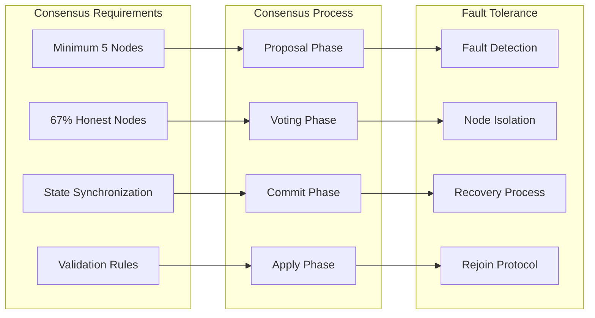

### Consensus Algorithm Flow

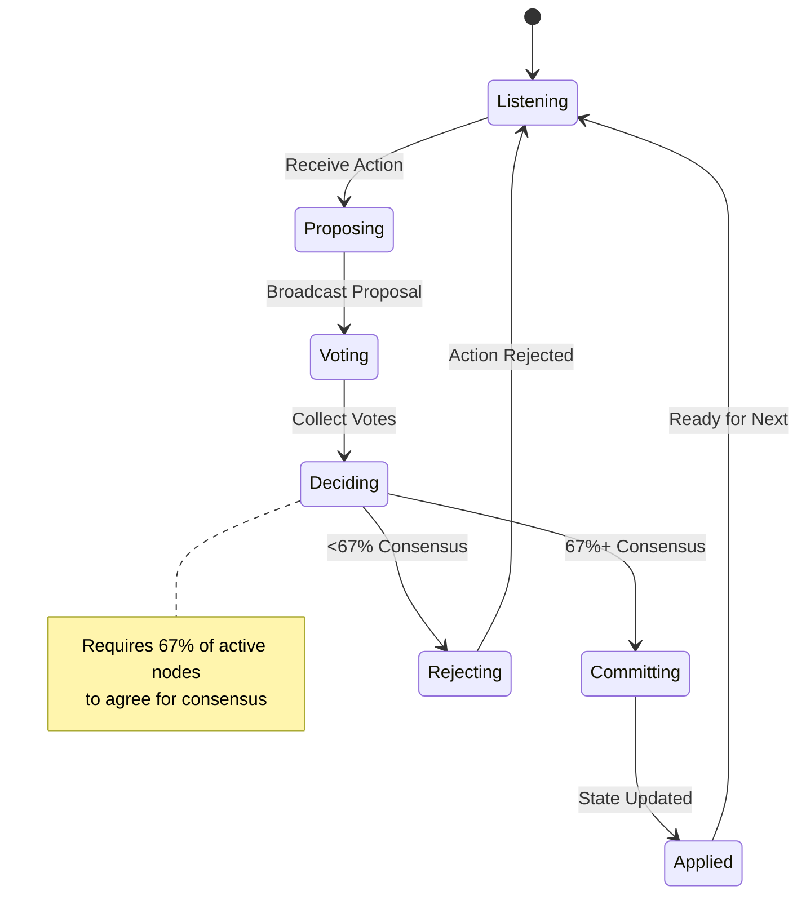

### State Synchronization Protocol

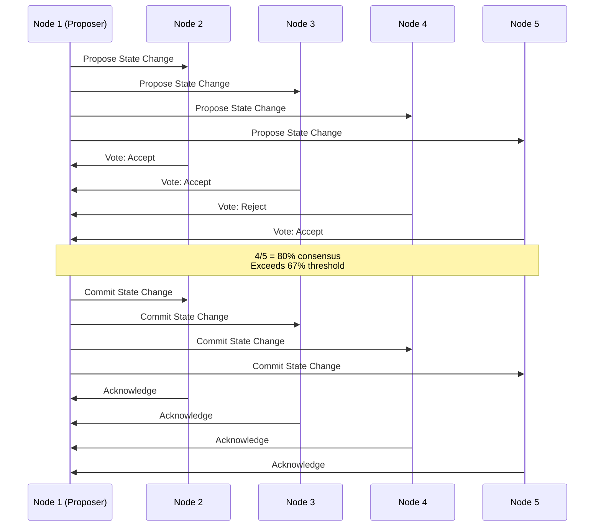

## Infrastructure Deployment

### Zero Infrastructure Architecture

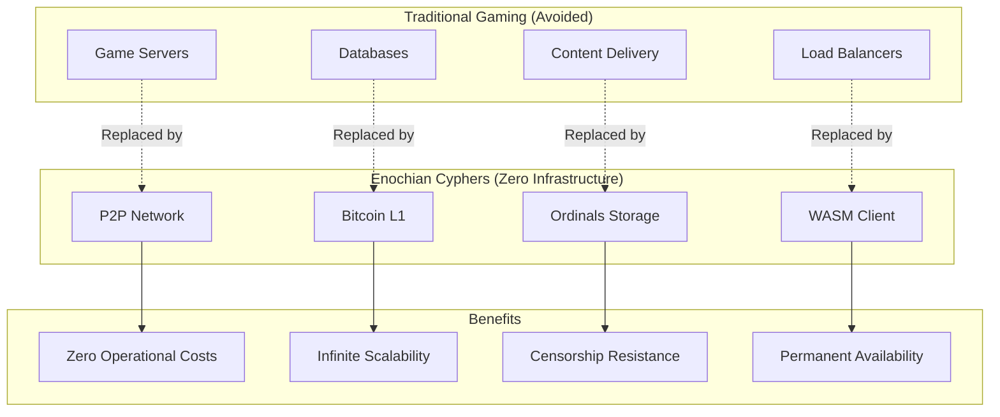

### Client Deployment Strategy

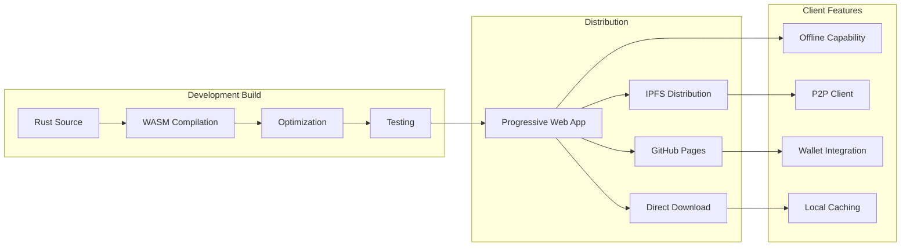

## Bitcoin L1 Deployment Strategy

### 4-Week Testnet Timeline

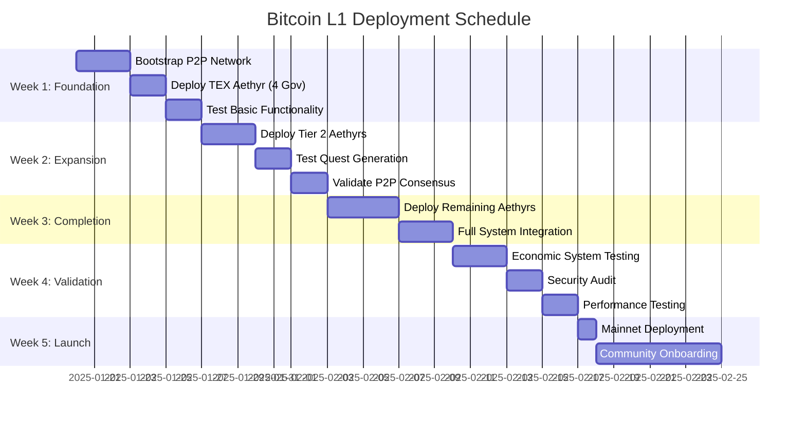

### Aethyr Deployment Sequence

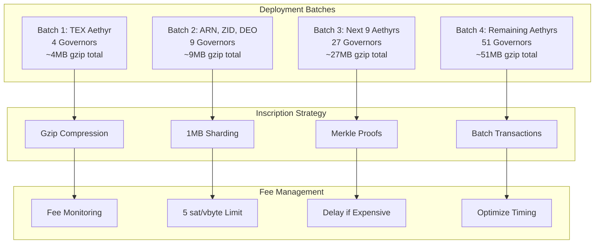

## Operational Procedures

### Deployment Checklist

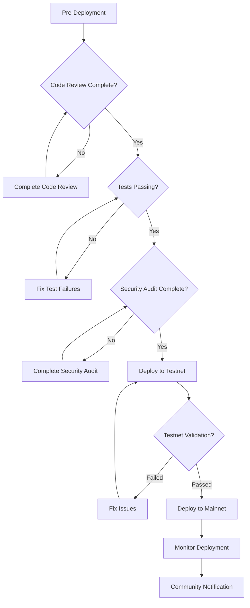

### Monitoring and Alerting

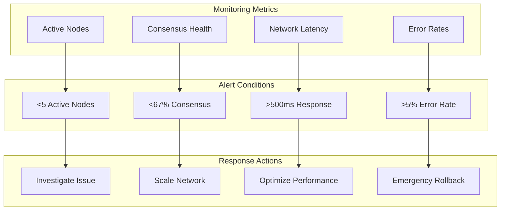

### Disaster Recovery

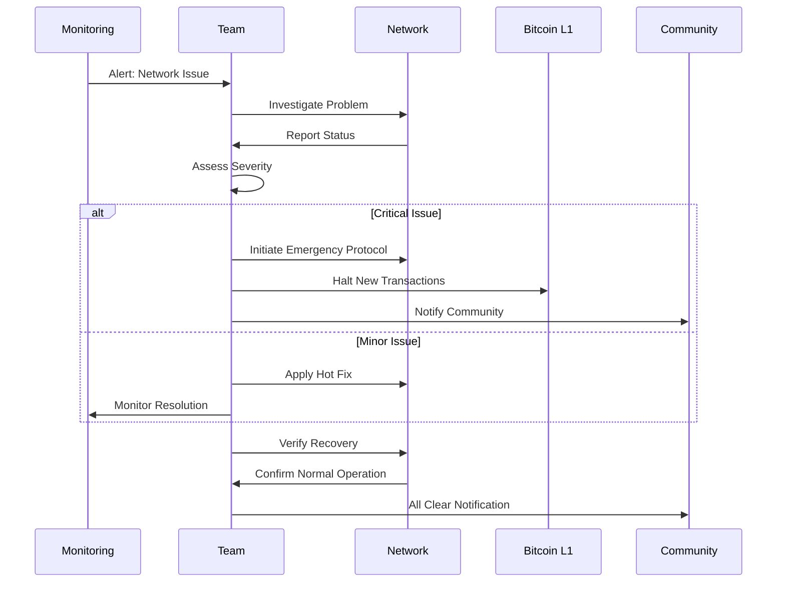

## Autonomous Treasury Management

### Treasury Allocation & Distribution

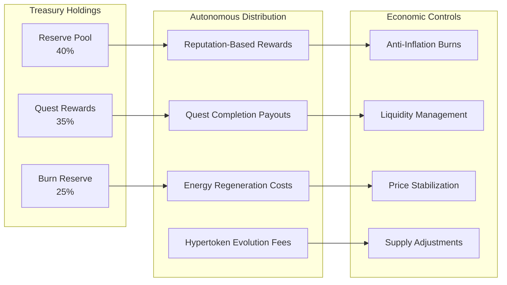

### Autonomous Economic Flow

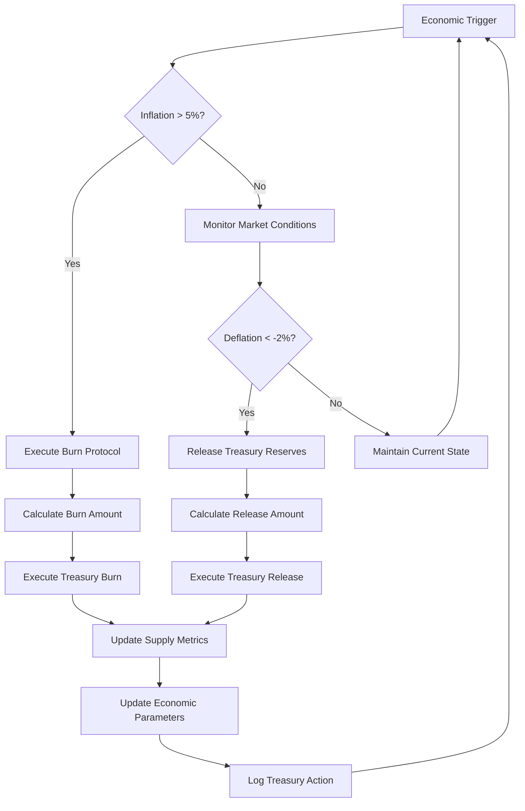

## Autonomous Governance Deployment

### Autonomous Governance Systems Deployment

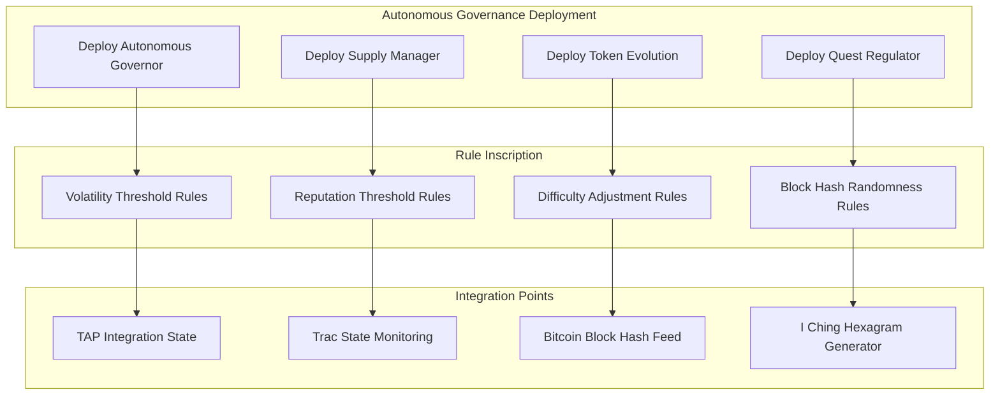

### Autonomous Governance Implementation Steps

#### Phase 1: Core Autonomous Systems (Week 4.5)

1. **Deploy Autonomous Supply Governor**
   ```bash
   # Deploy autonomous governance contract
   cargo build --release --target wasm32-unknown-unknown
   trac deploy autonomous_governance.wasm --ordinal-inscription
   ```

2. **Configure Volatility Monitoring**
   ```rust
   // Inscribe volatility rules on Bitcoin L1
   let volatility_rules = AutonomousRules {
       volatility_threshold: 0.05,  // 5%
       burn_rate: 0.05,             // 5% burn
       monitoring_frequency: 144,    // Every 24 hours (144 blocks)
   };
   ```

3. **Deploy Token Evolution System**
   ```rust
   // Inscribe evolution thresholds
   let evolution_rules = EvolutionRules {
       thresholds: [25, 50, 75, 100],
       selfishness_penalty: 0.2,
       deterministic_seed_source: "bitcoin_block_hash",
   };
   ```

4. **Deploy Quest Difficulty Regulator**
   ```rust
   // Inscribe difficulty adjustment rules
   let difficulty_rules = DifficultyRules {
       failure_rate_low: 0.3,   // Too easy
       failure_rate_high: 0.7,  // Too hard
       adjustment_magnitude: 0.2,
       hexagram_variance: true,
   };
   ```

#### Phase 2: Integration & Testing (Week 5)

1. **Trac State Integration**
   - Connect autonomous systems to Trac state monitoring
   - Implement real-time metrics collection
   - Validate state synchronization

2. **Bitcoin Block Hash Integration**
   - Implement deterministic randomness source
   - Connect I Ching hexagram generation
   - Validate reproducible results

3. **Economic Simulation Testing**
   - Run 1,000+ Monte Carlo simulations
   - Validate supply formula stability
   - Test edge cases and boundary conditions

#### Phase 3: Production Deployment (Week 6)

1. **Mainnet Deployment**
   ```bash
   # Deploy to Bitcoin mainnet
   trac deploy --network mainnet autonomous_governance.wasm
   trac deploy --network mainnet token_evolution.wasm
   trac deploy --network mainnet quest_regulator.wasm
   ```

2. **Autonomous System Activation**
   ```rust
   // Activate autonomous governance
   let activation_block = current_block_height + 144; // 24 hour delay
   autonomous_governor.activate(activation_block);
   ```

3. **Monitoring & Validation**
   - Deploy monitoring dashboard
   - Set up automated alerts
   - Validate autonomous operation

### Autonomous Governance Validation

#### Economic Stability Tests
- **Supply Bounds**: Verify 100k-2M token limits enforced
- **Volatility Response**: Test automatic burns at >5% volatility
- **Reward Distribution**: Validate 10 tokens per quest completion
- **Penalty Application**: Confirm 20 tokens per failure penalty

#### Deterministic Behavior Tests
- **Reproducibility**: Same Bitcoin block hash produces identical results
- **I Ching Integration**: Verify 64 hexagram generation from block hashes
- **Evolution Triggers**: Test reputation threshold-based evolution
- **Difficulty Adjustment**: Validate failure rate-based difficulty changes

#### Integration Tests
- **TAP Protocol**: Verify state transitions work with autonomous decisions
- **Trac Systems**: Confirm real-time metrics collection and response
- **Bitcoin L1**: Test block hash retrieval and processing
- **Story Engine**: Validate quest generation with autonomous difficulty

---

*This deployment architecture ensures a robust, scalable, and truly decentralized launch of the Enochian Cyphers Story Engine on Bitcoin L1, with comprehensive operational procedures, autonomous treasury management, and fully autonomous governance systems that operate without human intervention.*
