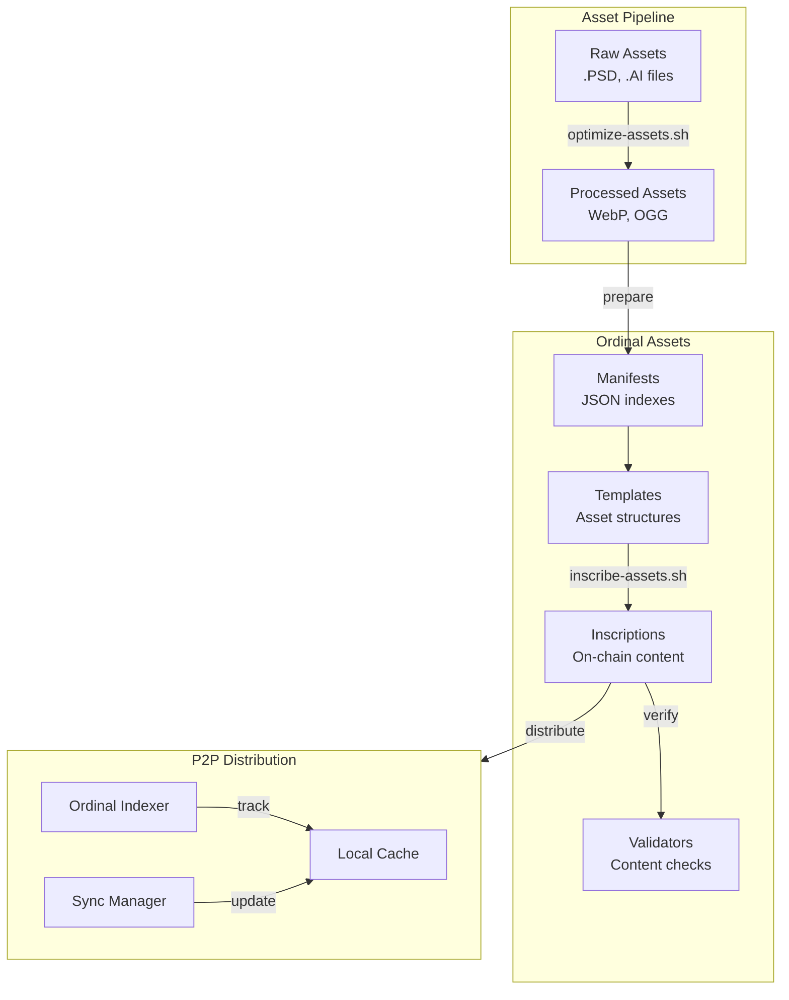

# Asset Pipeline and Inscription Flow

This diagram illustrates how assets are processed from raw files through optimization, inscription, and P2P distribution.

## Pipeline Components

### Asset Pipeline
- **Raw Assets**: Original source files (.PSD, .AI)
- **Processed Assets**: Optimized game-ready assets (WebP, OGG)

### Ordinal Assets
- **Manifests**: JSON indexes of assets
- **Templates**: Asset structure definitions
- **Inscriptions**: On-chain content storage
- **Validators**: Content verification tools

### P2P Distribution
- **Local Cache**: Client-side asset storage
- **Ordinal Indexer**: Tracks on-chain assets
- **Sync Manager**: Handles P2P synchronization 