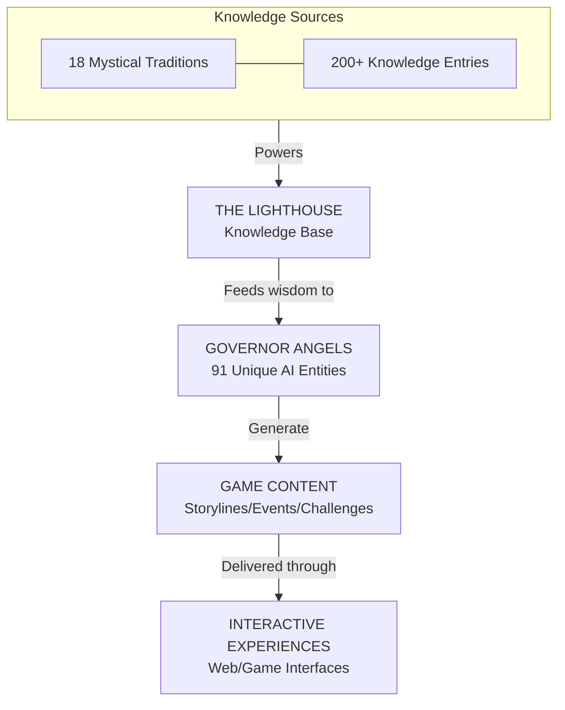

# Core Architecture Diagram

This diagram illustrates the fundamental architecture of the Enochian Governor Generation system, showing the relationship between major components.

## Component Description

- **THE LIGHTHOUSE (Knowledge Base)**: Central repository of mystical wisdom from 18 traditions
- **GOVERNOR ANGELS**: 91 unique AI entities that generate content and interact with players
- **GAME CONTENT**: Generated storylines, events, challenges, and riddles
- **INTERACTIVE EXPERIENCES**: Web and game interfaces for player interaction