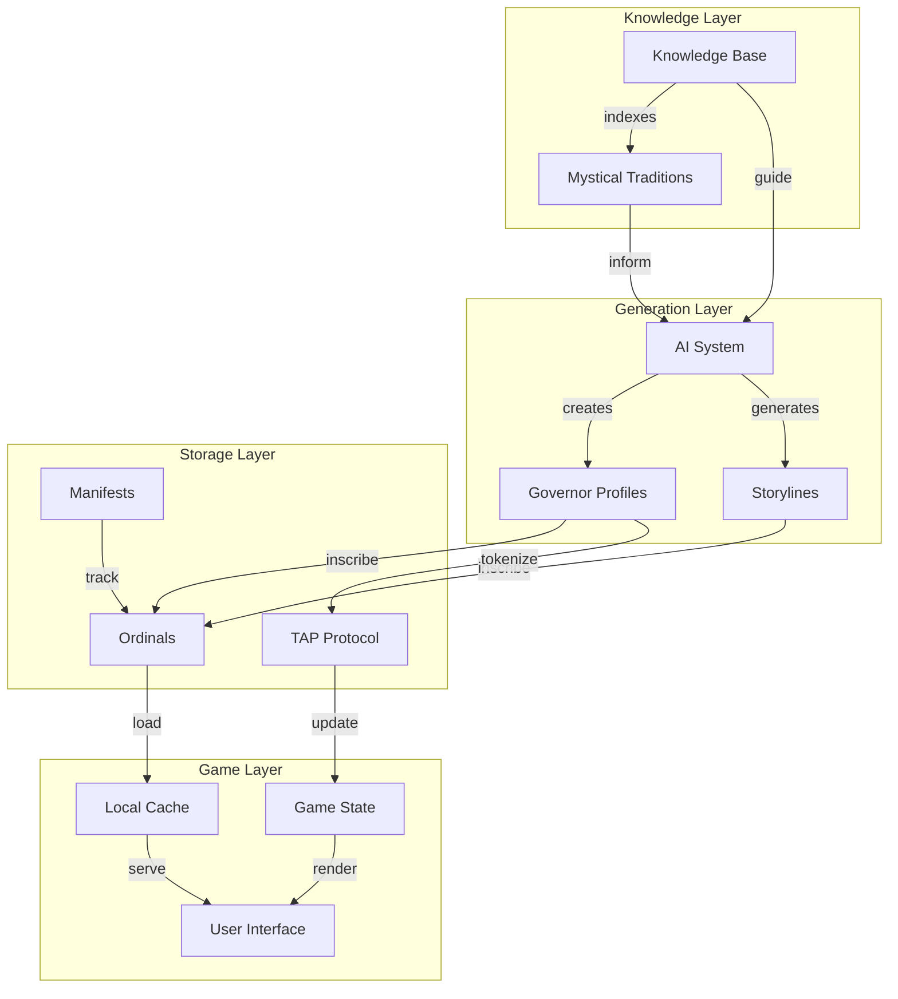

# System Data Flow

This diagram illustrates how data flows between different components of the system.

## Data Flow Description

### Knowledge Layer
- Knowledge Base indexes and organizes mystical traditions
- Provides structured data for AI generation

### Generation Layer
- AI system creates governor profiles and storylines
- Uses knowledge base for authentic content generation

### Storage Layer
- Ordinals store permanent content
- TAP protocol handles tokenized game logic
- Manifests track all inscribed content

### Game Layer
- Local cache serves content to UI
- Game state updated via TAP
- UI renders based on state and cached content

## Key Data Flows
1. Knowledge flows from traditions to AI
2. AI generates profiles and storylines
3. Content is inscribed to Bitcoin
4. Game state is managed via TAP
5. Players interact through cached content 