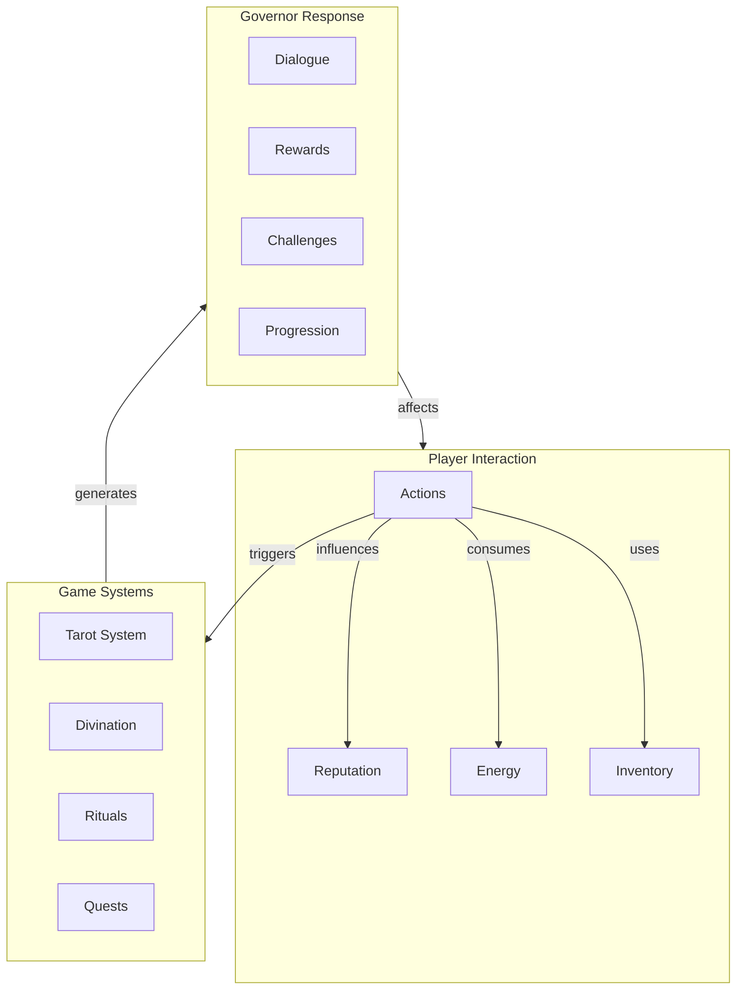

# Game Mechanics and Interaction Flow

This diagram illustrates how player actions, game systems, and governor responses interact within the game.

## System Components

### Player Interaction
- **Actions**: Player-initiated activities
- **Reputation**: Standing with governors
- **Energy**: Resource for actions
- **Inventory**: Collected items and artifacts

### Game Systems
- **Tarot System**: Card-based mechanics
- **Divination**: Mystical insight mechanics
- **Rituals**: Ceremonial actions
- **Quests**: Structured challenges

### Governor Response
- **Dialogue**: Interactive conversations
- **Rewards**: Achievement benefits
- **Challenges**: Tests and trials
- **Progression**: Advancement tracking

## Interaction Flow
1. Player initiates actions using energy and inventory items
2. Actions influence reputation and trigger game systems
3. Game systems generate appropriate governor responses
4. Governor responses affect player state and progression 