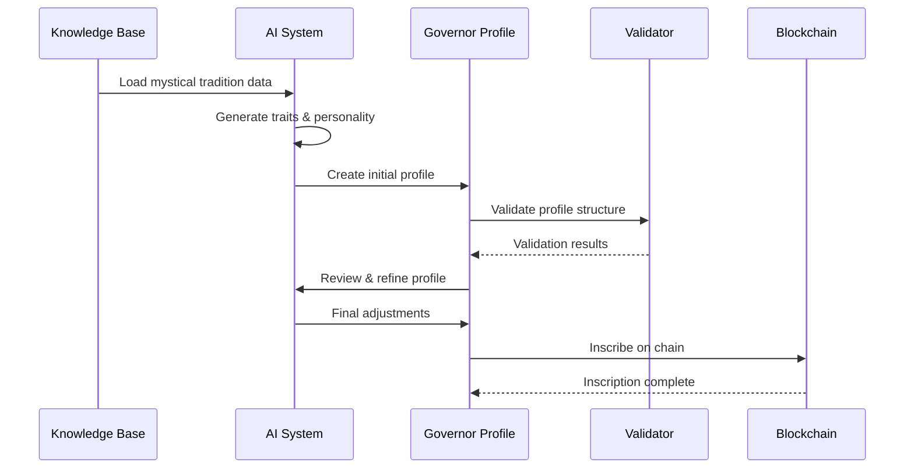

# Governor Generation Sequence

This diagram illustrates the step-by-step process of generating a governor profile from the knowledge base to blockchain inscription.

## Process Description

1. **Knowledge Base Loading**: System loads relevant mystical tradition data
2. **Trait Generation**: AI generates unique traits and personality
3. **Profile Creation**: Initial governor profile is created
4. **Validation**: Profile structure is validated against schema
5. **Review & Refinement**: AI reviews and refines the profile
6. **Final Adjustments**: Any necessary adjustments are made
7. **Blockchain Inscription**: Profile is permanently inscribed on chain

## Key Components

- **Knowledge Base**: Source of mystical wisdom
- **AI System**: Generates and refines governor profiles
- **Governor Profile**: The structured data representation
- **Validator**: Ensures profile integrity
- **Blockchain**: Permanent storage via inscription 