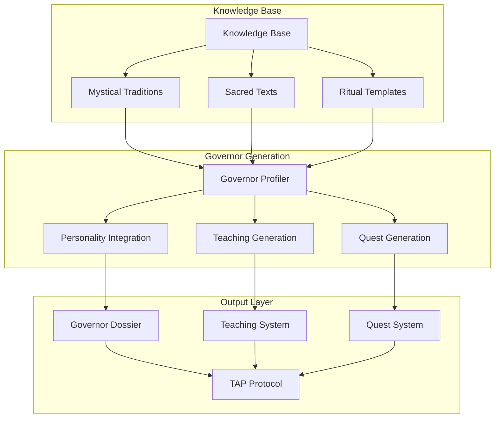
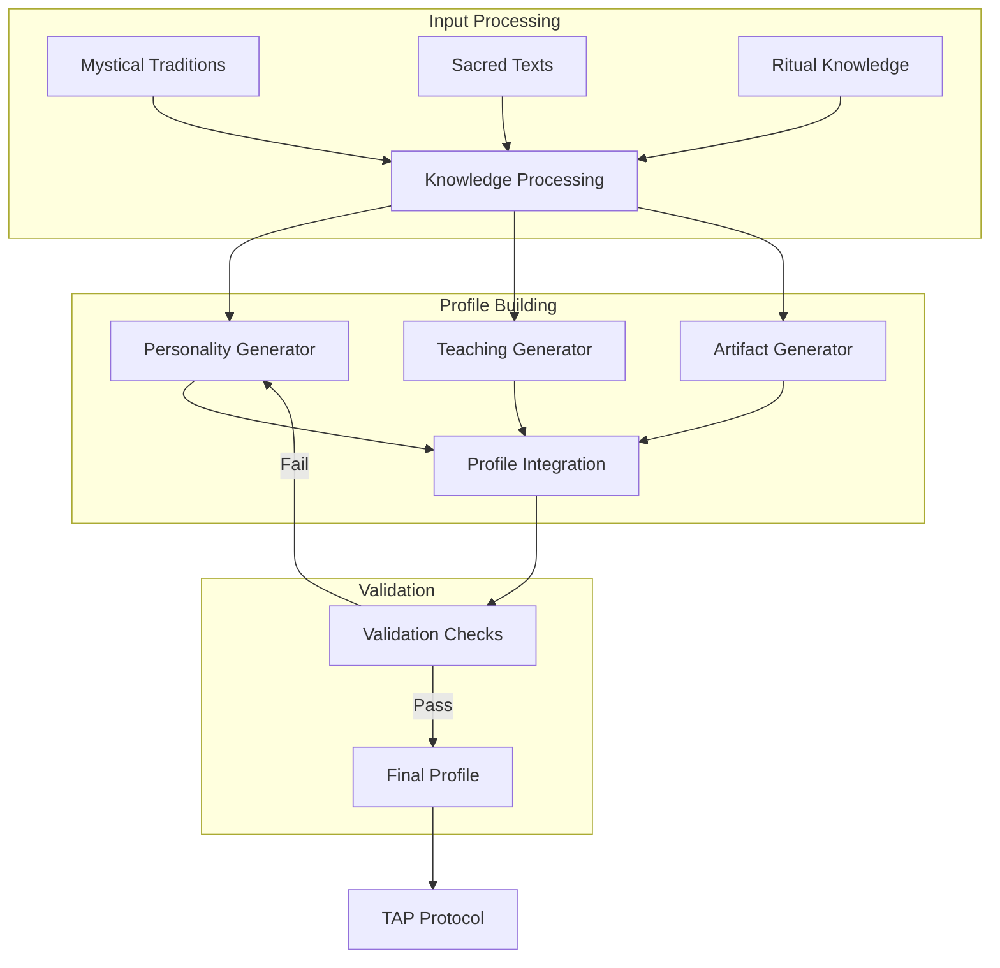
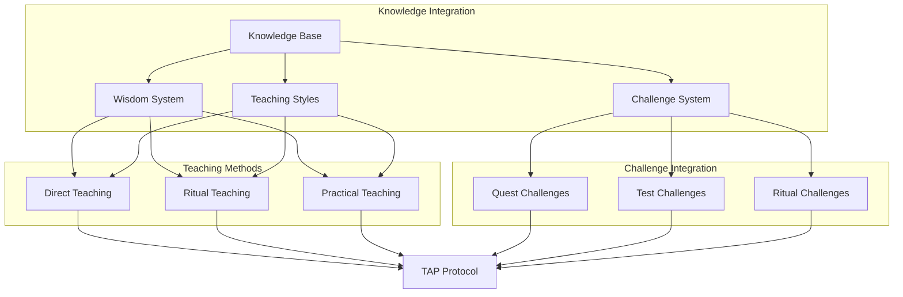
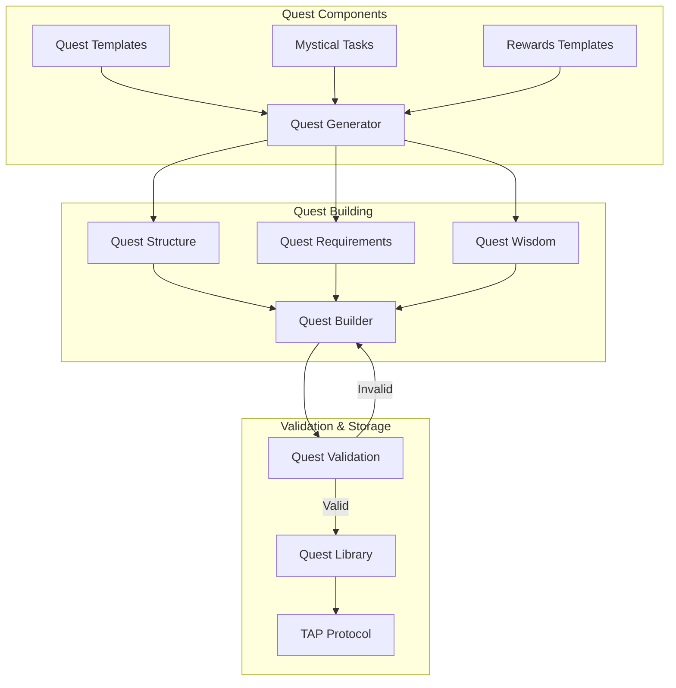
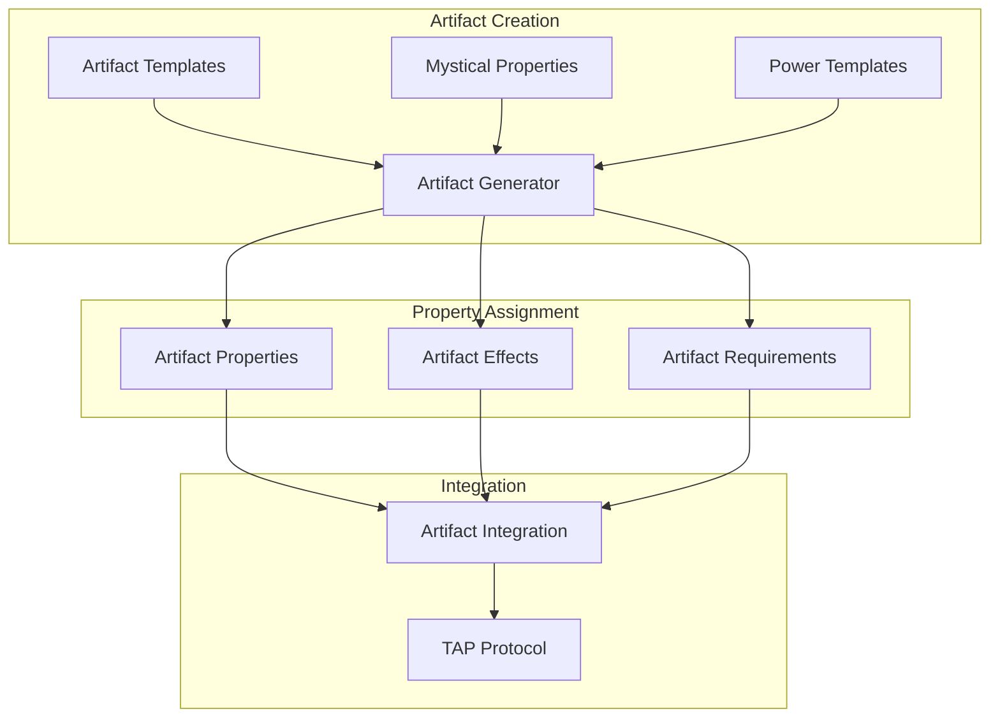
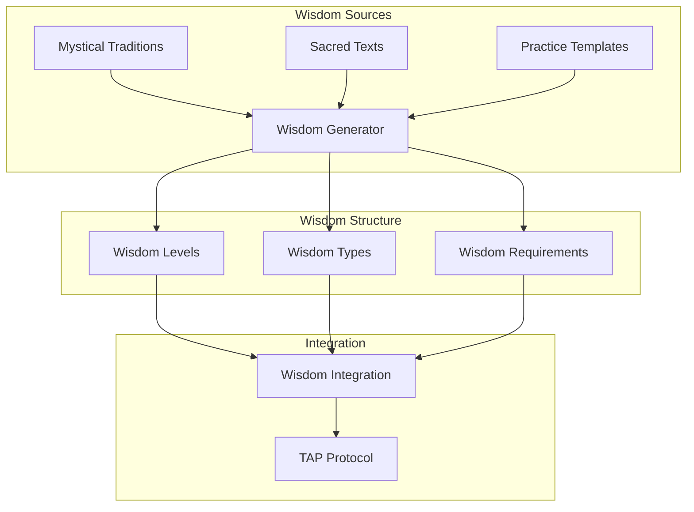

# Governor Generation System Diagrams

## System Architecture

## Governor Profile Generation

## Teaching System Architecture

## Quest Generation System

## Artifact System

## Wisdom System

