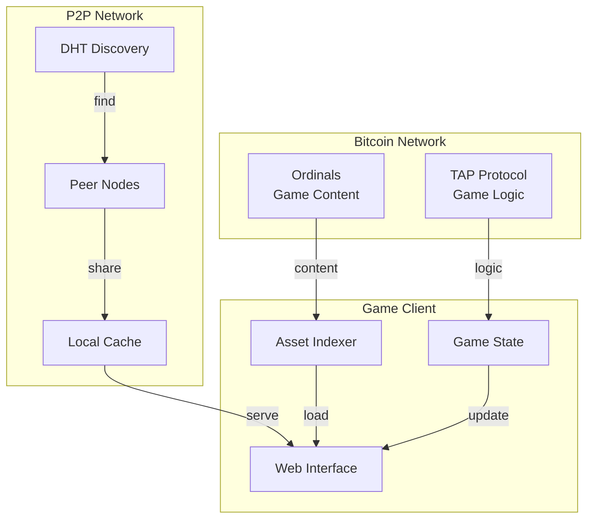

# P2P Network and Blockchain Integration

This diagram illustrates how the game integrates with Bitcoin (Ordinals and TAP) and manages P2P networking.

## System Components

### Bitcoin Network
- **Ordinals**: Stores game content as inscriptions
- **TAP Protocol**: Handles game logic and state transitions

### P2P Network
- **DHT Discovery**: Peer discovery mechanism
- **Peer Nodes**: Connected game clients
- **Local Cache**: Client-side content storage

### Game Client
- **Web Interface**: Player-facing UI
- **Game State**: Local state management
- **Asset Indexer**: Tracks and loads assets

## Integration Flow
1. Game content is stored on Bitcoin via Ordinals
2. Game logic is handled through TAP Protocol
3. Peers discover each other through DHT
4. Content is shared between peers
5. Clients maintain local cache and state
6. UI is updated based on state and loaded content

## Zero-Infrastructure Benefits
- No central servers required
- Content permanently stored on Bitcoin
- P2P distribution reduces bandwidth costs
- Local caching enables offline play 