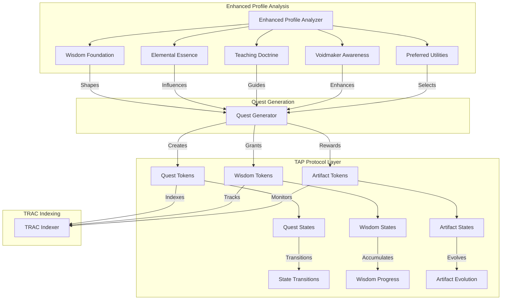
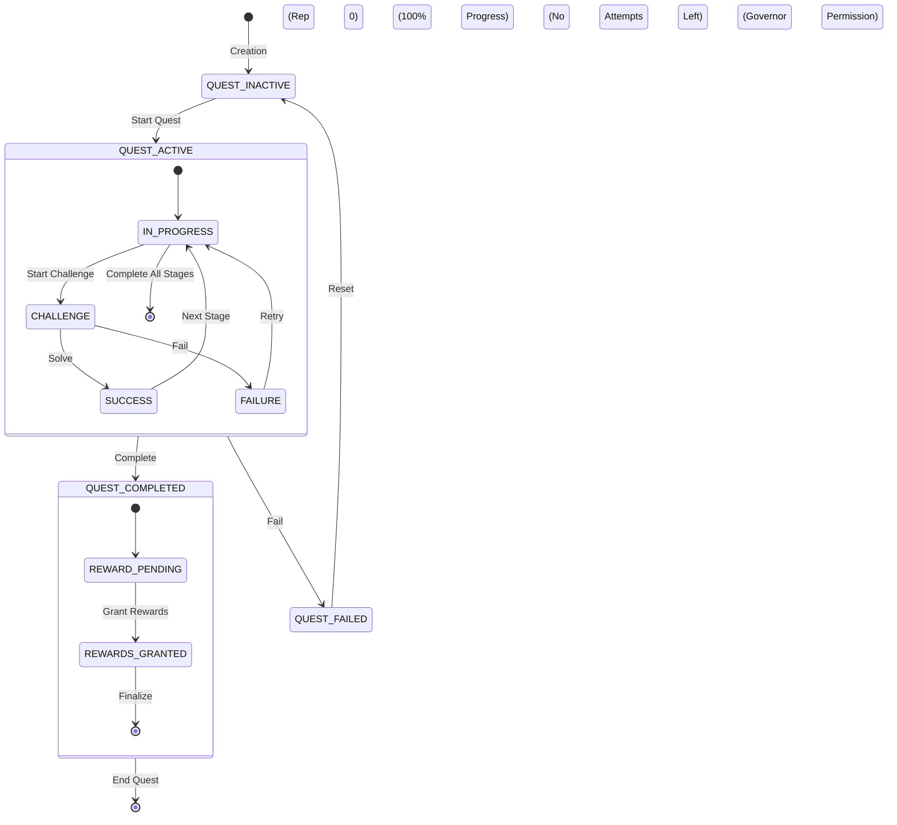

# Quest Generation Flow Diagrams

## System Overview

```mermaid
graph TB
    subgraph "Enhanced Profile Analysis"
        EPA[Enhanced Profile Analyzer] --> WF[Wisdom Foundation]
        EPA --> EE[Elemental Essence]
        EPA --> TD[Teaching Doctrine]
        EPA --> VA[Voidmaker Awareness]
        EPA --> PU[Preferred Utilities]
    end

    subgraph "TAP Protocol Layer"
        QT[Quest Tokens] --> QS[Quest States]
        WT[Wisdom Tokens] --> WS[Wisdom States]
        AT[Artifact Tokens] --> AS[Artifact States]

        QS --> |"Transitions"| QST[State Transitions]
        WS --> |"Accumulates"| WST[Wisdom Progress]
        AS --> |"Evolves"| AST[Artifact Evolution]
    end

    subgraph "Quest Generation"
        WF --> |"Shapes"| QG[Quest Generator]
        EE --> |"Influences"| QG
        TD --> |"Guides"| QG
        VA --> |"Enhances"| QG
        PU --> |"Selects"| QG

        QG --> |"Creates"| QT
        QG --> |"Grants"| WT
        QG --> |"Rewards"| AT
    end

    subgraph "TRAC Indexing"
        QT --> |"Indexes"| TI[TRAC Indexer]
        WT --> |"Tracks"| TI
        AT --> |"Monitors"| TI
    end
```

## Quest State Machine

```mermaid
stateDiagram-v2
    [*] --> QUEST_INACTIVE: Creation
    QUEST_INACTIVE --> QUEST_ACTIVE: Start Quest
(Rep  0)
    QUEST_ACTIVE --> QUEST_COMPLETED: Complete
(100% Progress)
    QUEST_ACTIVE --> QUEST_FAILED: Fail
(No Attempts Left)
    QUEST_FAILED --> QUEST_INACTIVE: Reset
(Governor Permission)
    QUEST_COMPLETED --> [*]: End Quest

    state QUEST_ACTIVE {
        [*] --> IN_PROGRESS
        IN_PROGRESS --> CHALLENGE: Start Challenge
        CHALLENGE --> SUCCESS: Solve
        CHALLENGE --> FAILURE: Fail
        SUCCESS --> IN_PROGRESS: Next Stage
        FAILURE --> IN_PROGRESS: Retry
        IN_PROGRESS --> [*]: Complete All Stages
    }

    state QUEST_COMPLETED {
        [*] --> REWARD_PENDING
        REWARD_PENDING --> REWARDS_GRANTED: Grant Rewards
        REWARDS_GRANTED --> [*]: Finalize
    }
```