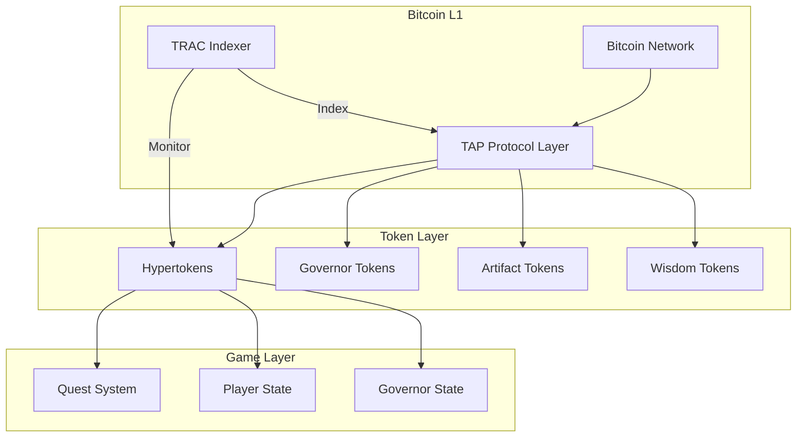
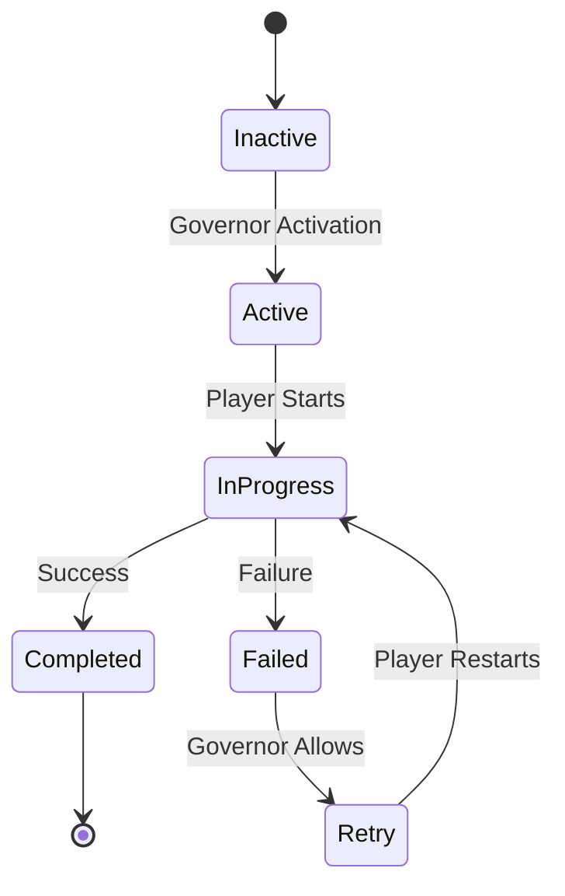
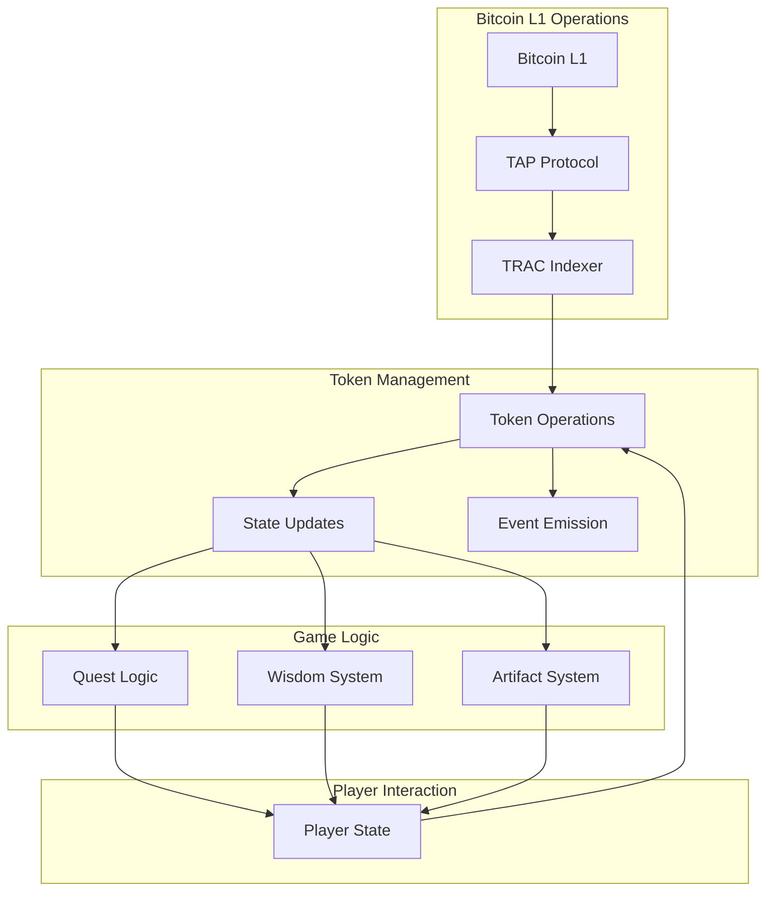
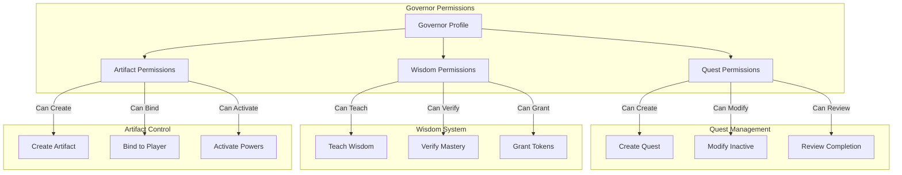
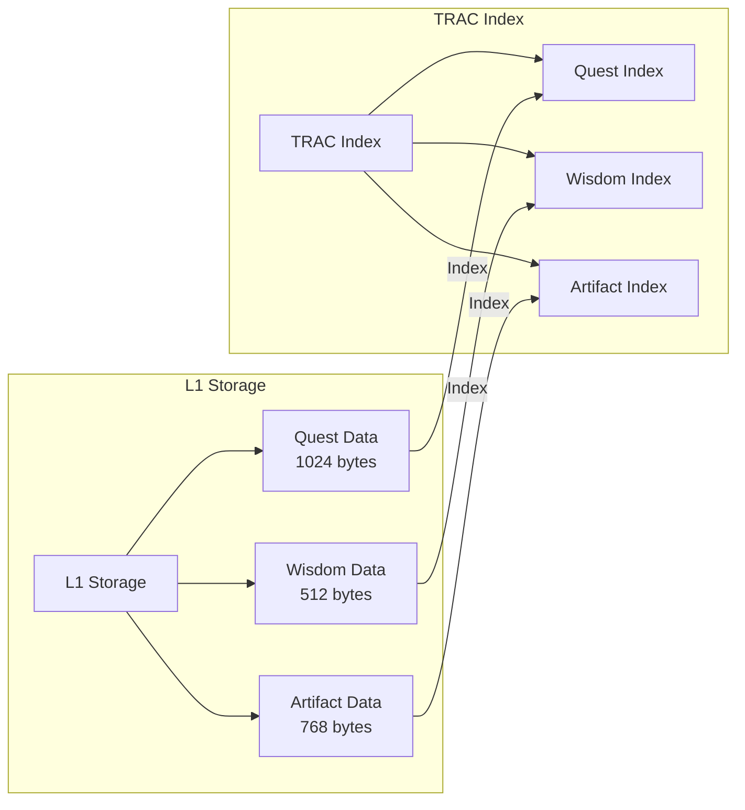
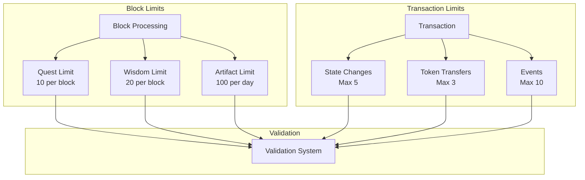

# TAP Protocol Architecture Diagrams

## System Overview

## Token State Transitions

## Data Flow Architecture

## Governor Permission Model

## Storage Architecture

## Rate Limiting System

