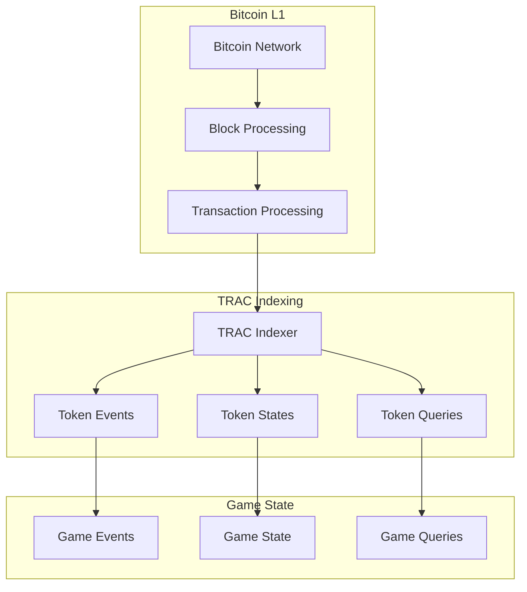
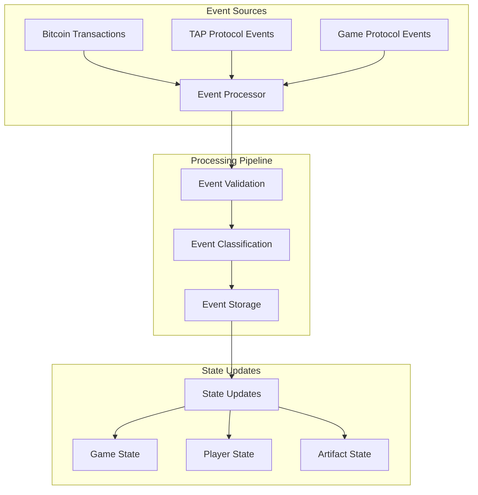
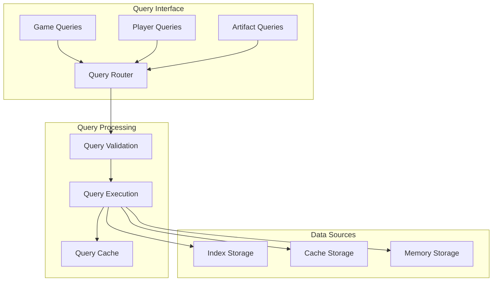
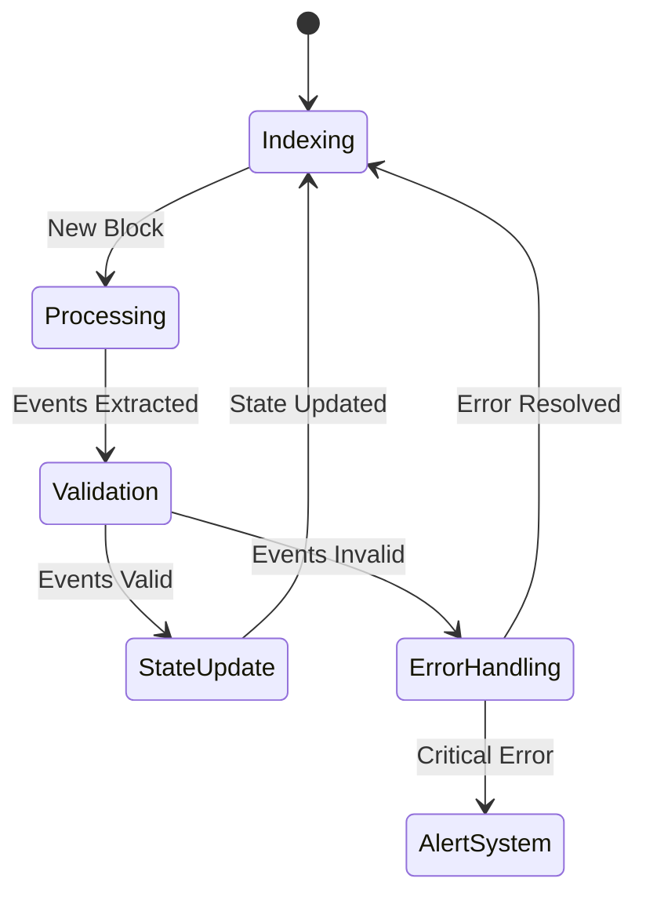
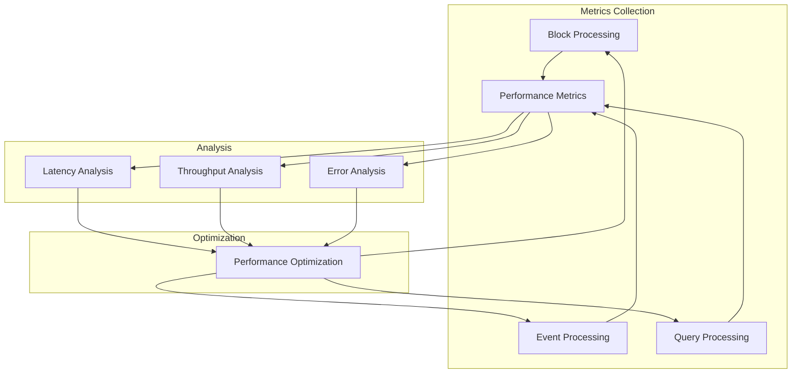
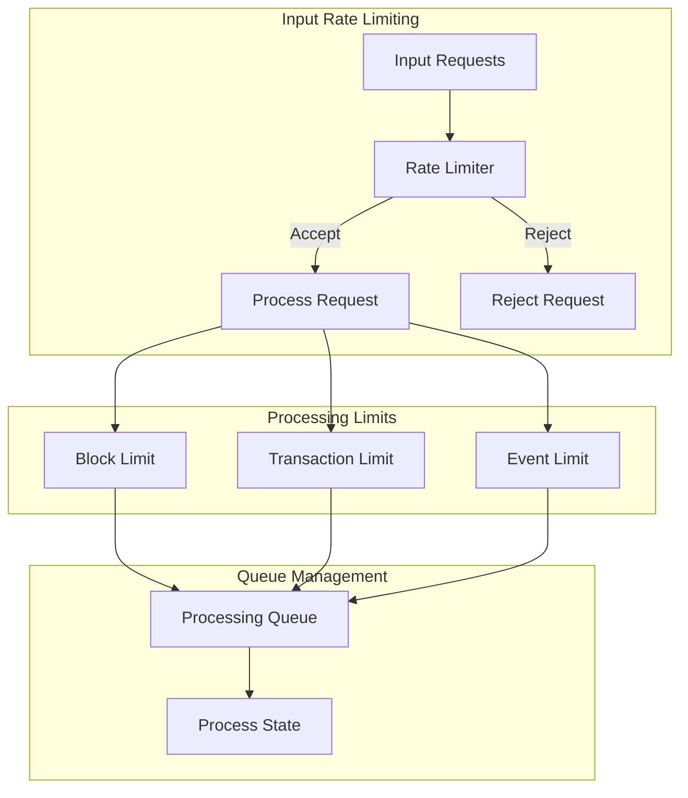

# TRAC Indexing System Diagrams

## System Overview

```mermaid
graph TB
    subgraph "Bitcoin L1"
        BTC["Bitcoin Network"] --> BLK["Block Processing"]
        BLK --> TX["Transaction Processing"]
    end

    subgraph "TRAC Indexing"
        TX --> TI["TRAC Indexer"]
        TI --> TE["Token Events"]
        TI --> TS["Token States"]
        TI --> TQ["Token Queries"]
    end

    subgraph "Game State"
        TE --> GE["Game Events"]
        TS --> GS["Game State"]
        TQ --> GQ["Game Queries"]
    end
```

## Event Processing Flow

```mermaid
flowchart TD
    subgraph "Event Sources"
        BT["Bitcoin Transactions"] --> EP["Event Processor"]
        TP["TAP Protocol Events"] --> EP
        GP["Game Protocol Events"] --> EP
    end

    subgraph "Processing Pipeline"
        EP --> EV["Event Validation"]
        EV --> EC["Event Classification"]
        EC --> ES["Event Storage"]
    end

    subgraph "State Updates"
        ES --> SU["State Updates"]
        SU --> GS["Game State"]
        SU --> PS["Player State"]
        SU --> AS["Artifact State"]
    end
```

## Query System

```mermaid
graph TD
    subgraph "Query Interface"
        GQ["Game Queries"] --> QR["Query Router"]
        PQ["Player Queries"] --> QR
        AQ["Artifact Queries"] --> QR
    end

    subgraph "Query Processing"
        QR --> QV["Query Validation"]
        QV --> QE["Query Execution"]
        QE --> QC["Query Cache"]
    end

    subgraph "Data Sources"
        QE --> IS["Index Storage"]
        QE --> CS["Cache Storage"]
        QE --> MS["Memory Storage"]
    end
```

## State Management

```mermaid
stateDiagram-v2
    [*] --> Indexing
    Indexing --> Processing: New Block
    Processing --> Validation: Events Extracted
    Validation --> StateUpdate: Events Valid
    Validation --> ErrorHandling: Events Invalid
    StateUpdate --> Indexing: State Updated
    ErrorHandling --> Indexing: Error Resolved
    ErrorHandling --> AlertSystem: Critical Error
```

## Performance Monitoring

```mermaid
graph TD
    subgraph "Metrics Collection"
        BP["Block Processing"] --> PM["Performance Metrics"]
        EP["Event Processing"] --> PM
        QP["Query Processing"] --> PM
    end

    subgraph "Analysis"
        PM --> LA["Latency Analysis"]
        PM --> TA["Throughput Analysis"]
        PM --> EA["Error Analysis"]
    end

    subgraph "Optimization"
        LA --> PO["Performance Optimization"]
        TA --> PO
        EA --> PO
        
        PO --> BP
        PO --> EP
        PO --> QP
    end
```

## Rate Limiting System

```mermaid
graph TD
    subgraph "Input Rate Limiting"
        IR["Input Requests"] --> RL["Rate Limiter"]
        RL --> |"Accept"| PR["Process Request"]
        RL --> |"Reject"| RR["Reject Request"]
    end

    subgraph "Processing Limits"
        PR --> BL["Block Limit"]
        PR --> TL["Transaction Limit"]
        PR --> EL["Event Limit"]
    end

    subgraph "Queue Management"
        BL --> PQ["Processing Queue"]
        TL --> PQ
        EL --> PQ
        
        PQ --> PS["Process State"]
    end
``` 