# Technical Integration Architecture

## Overview

This document maps the technical integrations, data flows, and component interactions within the Enochian Cyphers Story Engine. It provides detailed architectural diagrams for system interconnections and integration patterns.

## System Integration Overview

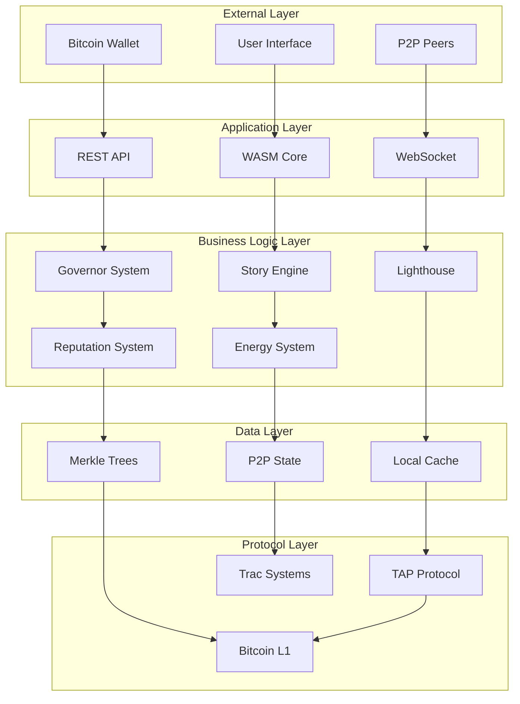

## Component Integration Patterns

### Lighthouse Integration Pattern

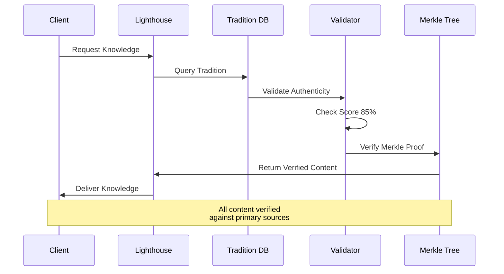

### Governor Angel Integration Pattern

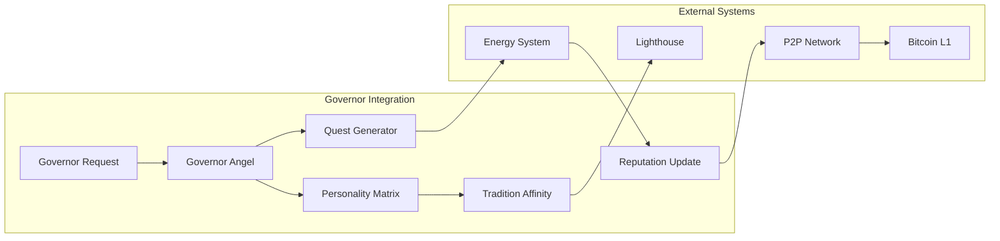

### Quest System Integration Pattern

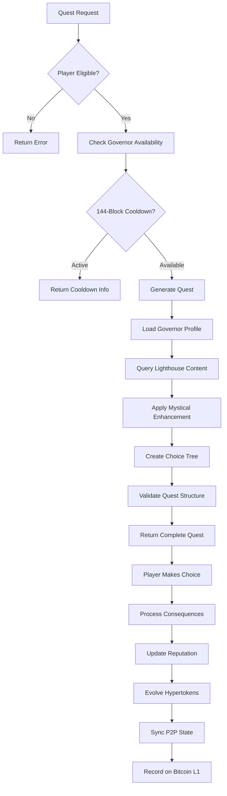

## Data Flow Architecture

### Knowledge Retrieval Flow

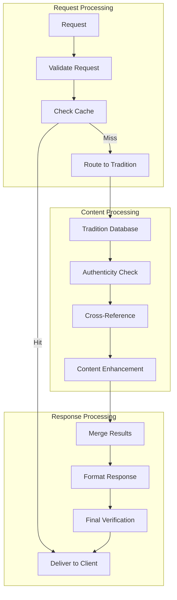

### Player Action Processing Flow

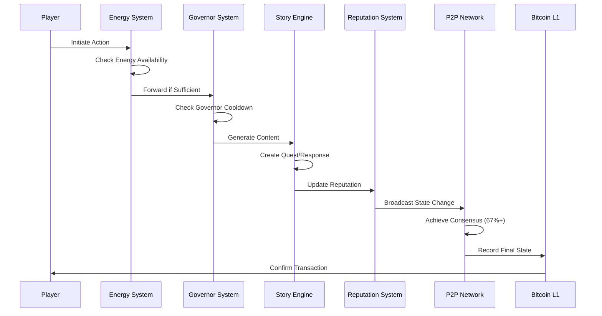

### Hypertoken Evolution Flow

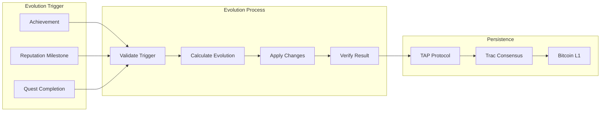

## API Integration Architecture

### REST API Integration

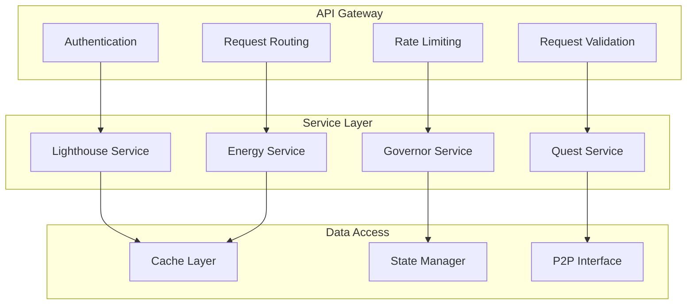

### WASM Integration

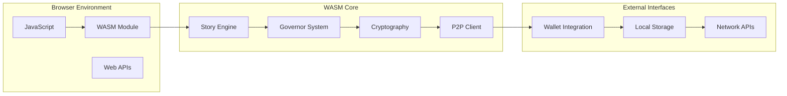

## P2P Network Integration

### Peer Discovery and Connection

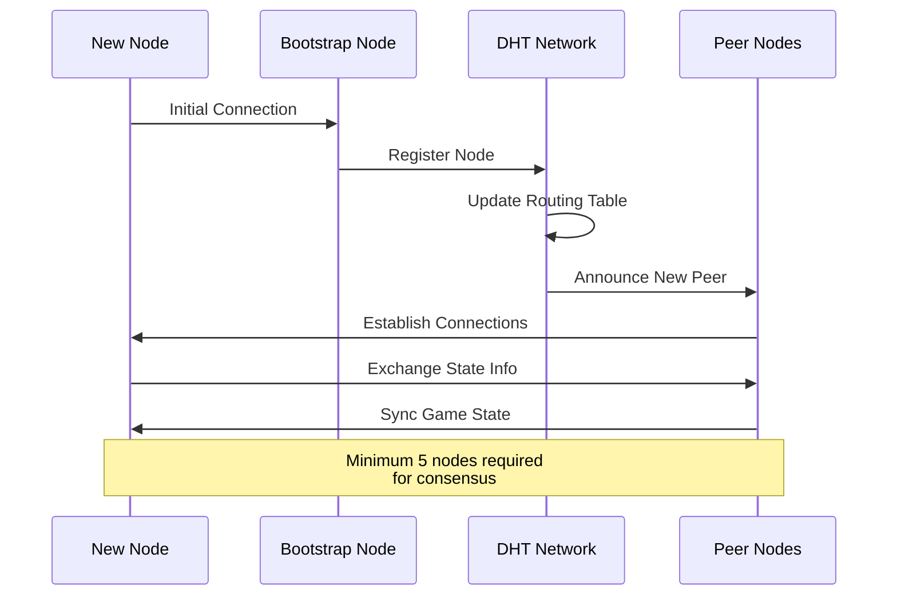

### Consensus Mechanism Integration

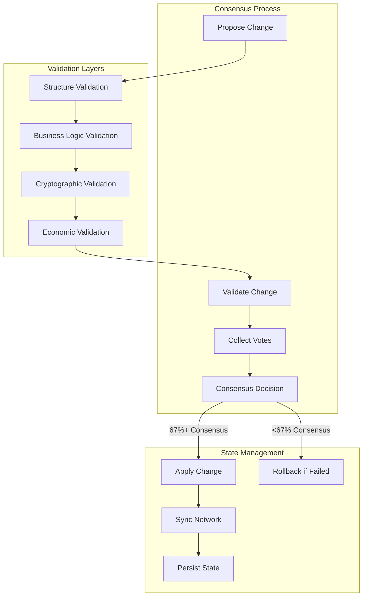

## Error Handling and Recovery

### Integration Error Patterns

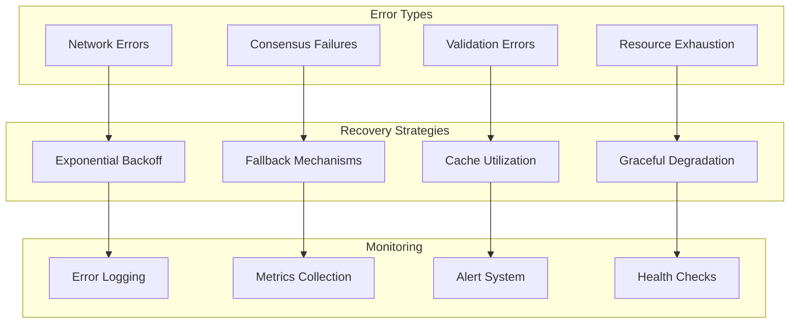

### Circuit Breaker Pattern

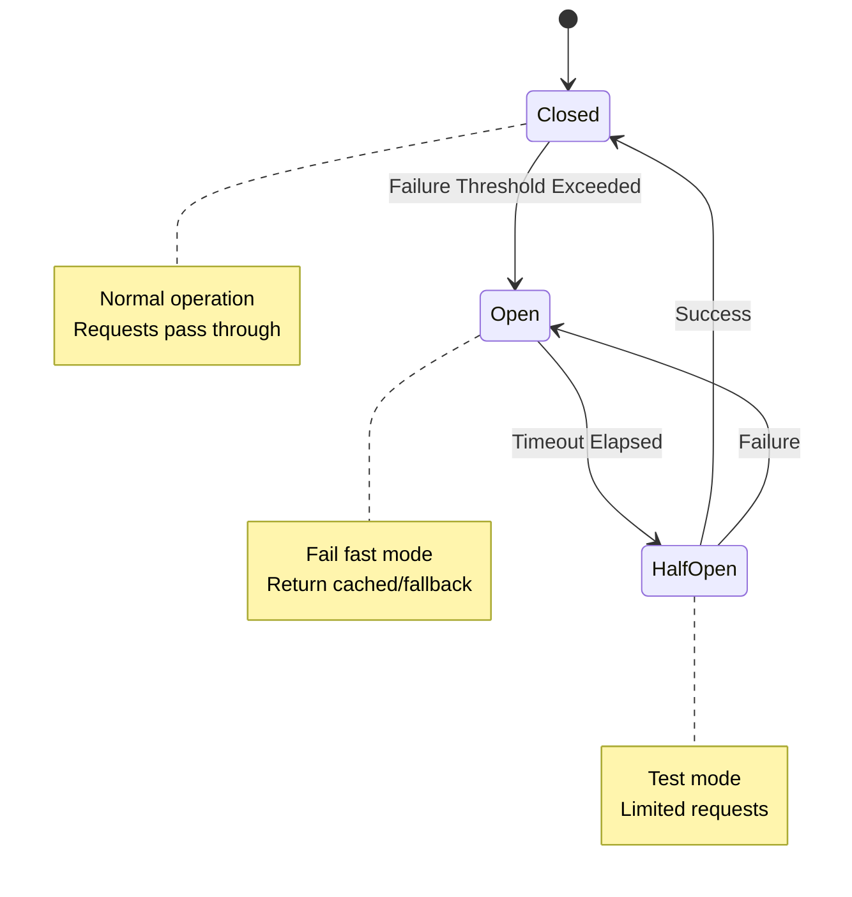

## Performance Integration

### Caching Strategy Integration

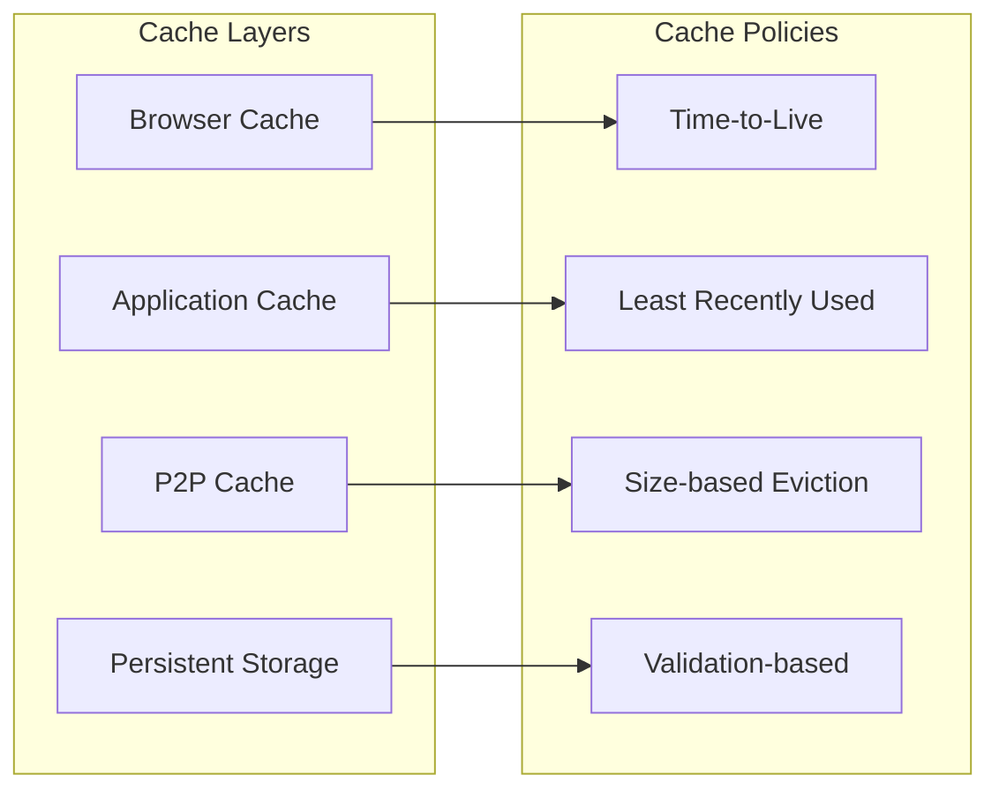

### Load Balancing Integration

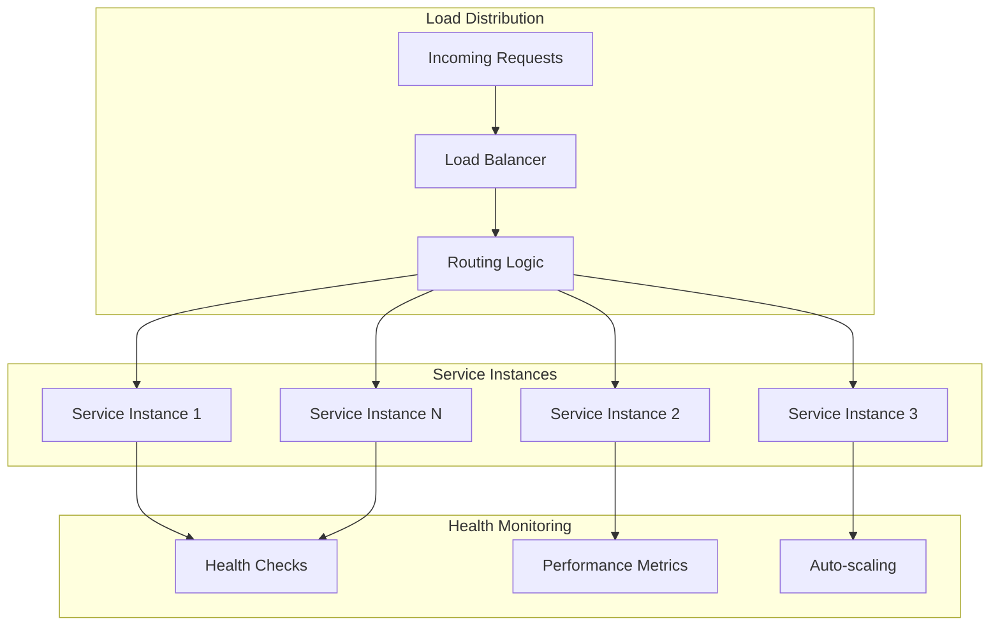

---

*This integration architecture provides the complete technical framework for system interconnections, ensuring robust, scalable, and fault-tolerant operation of the Enochian Cyphers Story Engine.*
