# Enochian Cyphers: System Architecture

## Executive Summary

The Enochian Cyphers system architecture represents a revolutionary Bitcoin L1-native RPG built on six foundational layers. This document provides comprehensive architectural maps for all core systems, their interactions, and deployment strategies.

**⚠️ IMPLEMENTATION STATUS UPDATE (Post-QA Analysis):**
- **Current Completion**: ~35% (previously claimed 85%)
- **Critical Gaps**: Testing framework, Byzantine consensus, O(1) verification, mobile optimization
- **Priority Focus**: Foundation systems before advanced features

## Core Architecture Layers

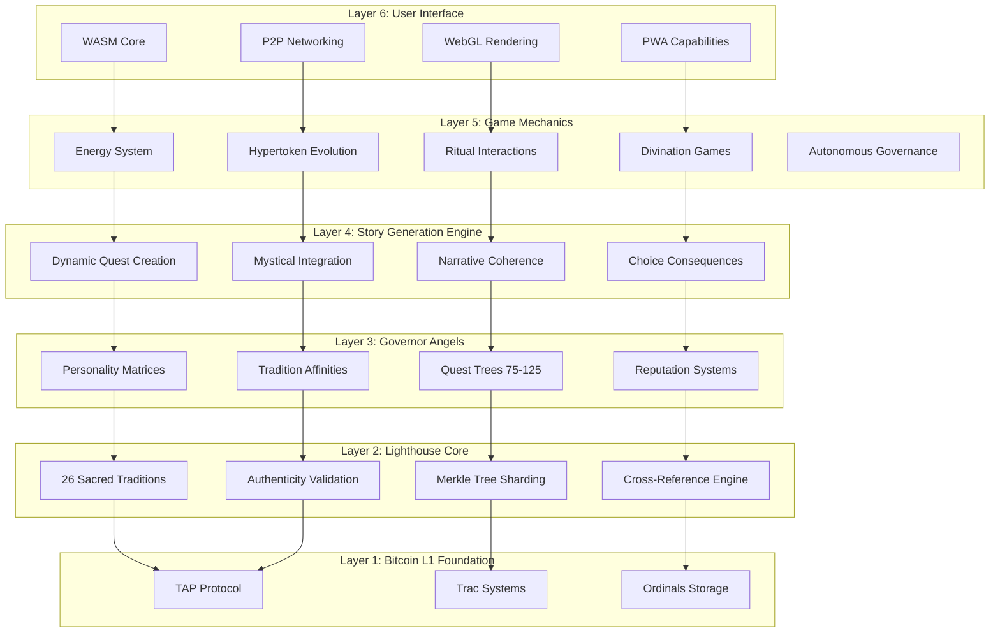

## System Component Architecture

### Lighthouse Core Architecture

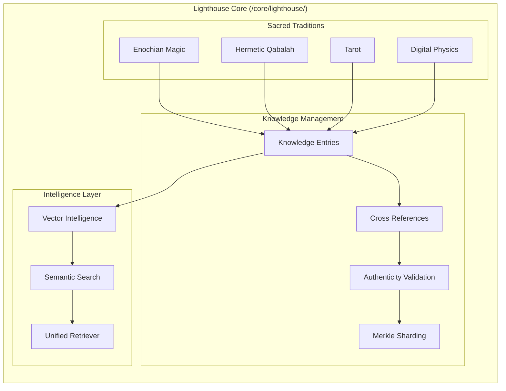

### Governor Angels Architecture

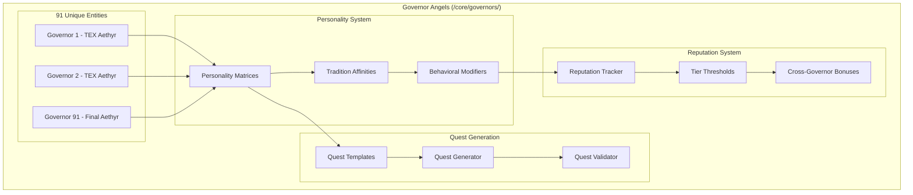

### Story Generation Engine Architecture

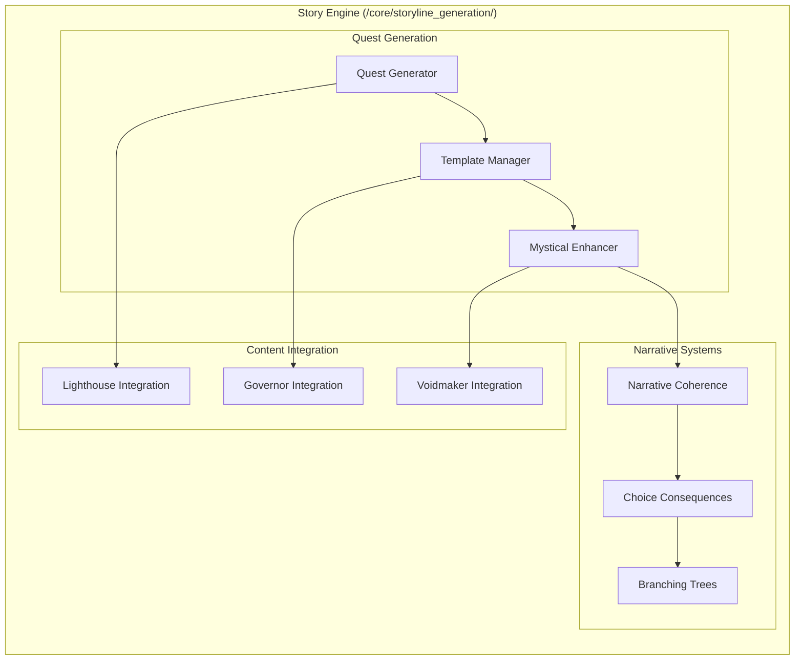

## Data Flow Architecture

### Quest Generation Flow

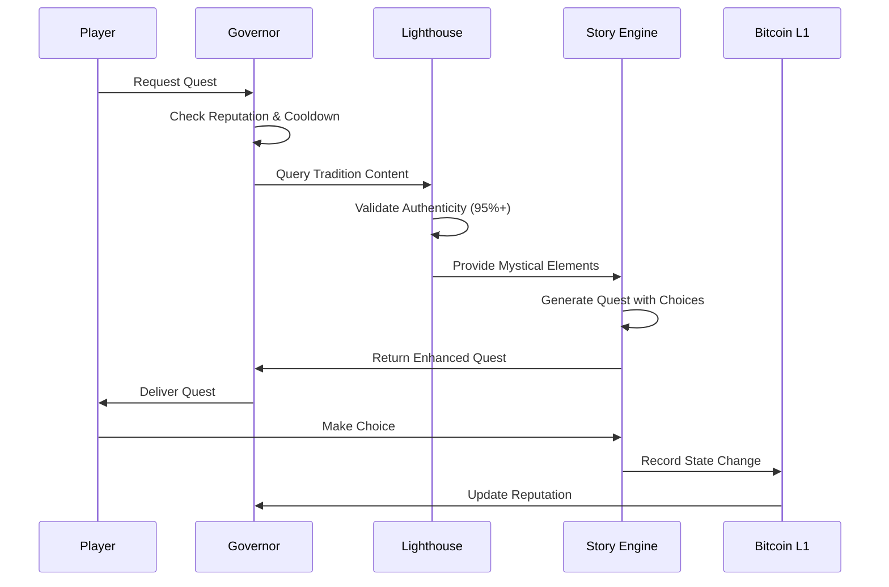

### Player Progression Flow

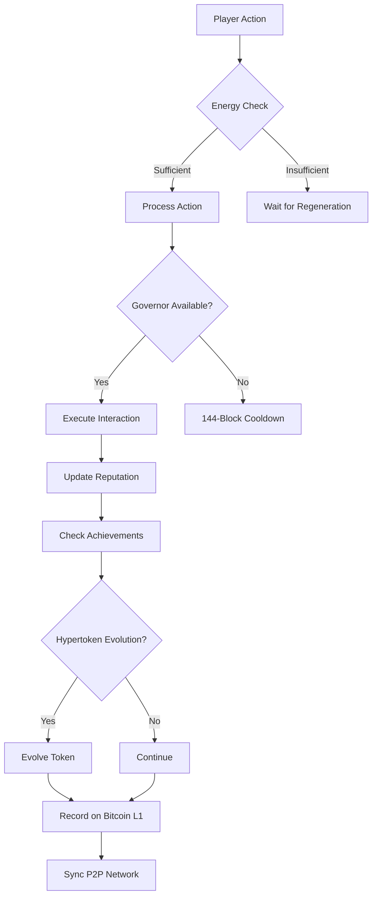

## Storage Architecture

### Merkle Tree Sharding Strategy

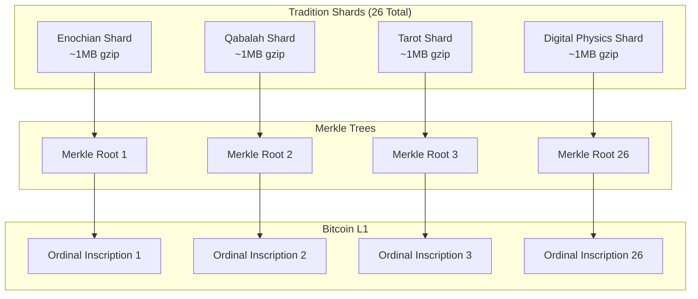

### State Management Architecture

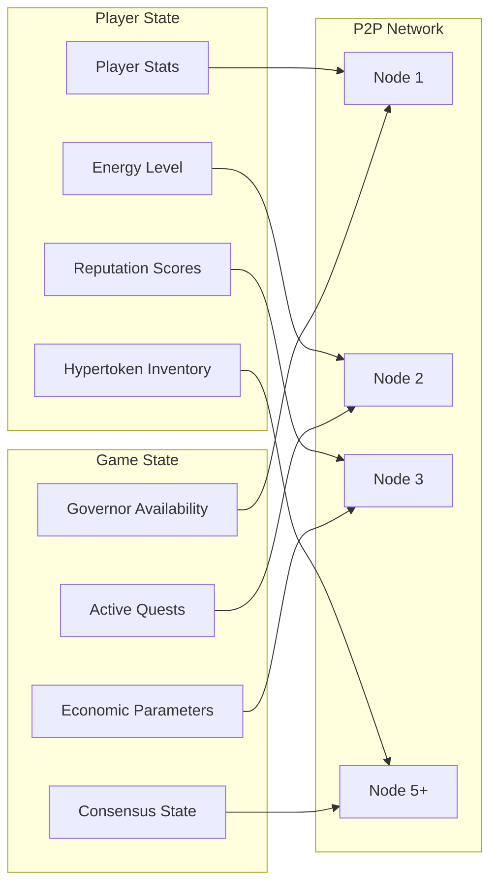

## Performance Architecture

### Response Time Optimization

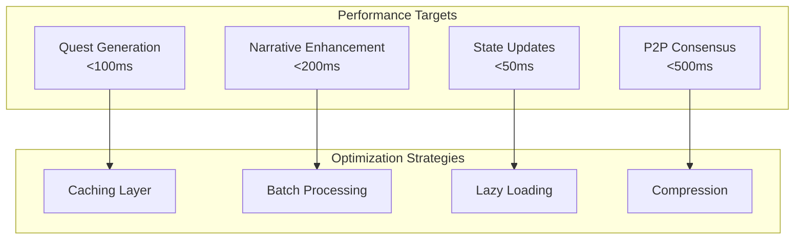

### Scalability Architecture

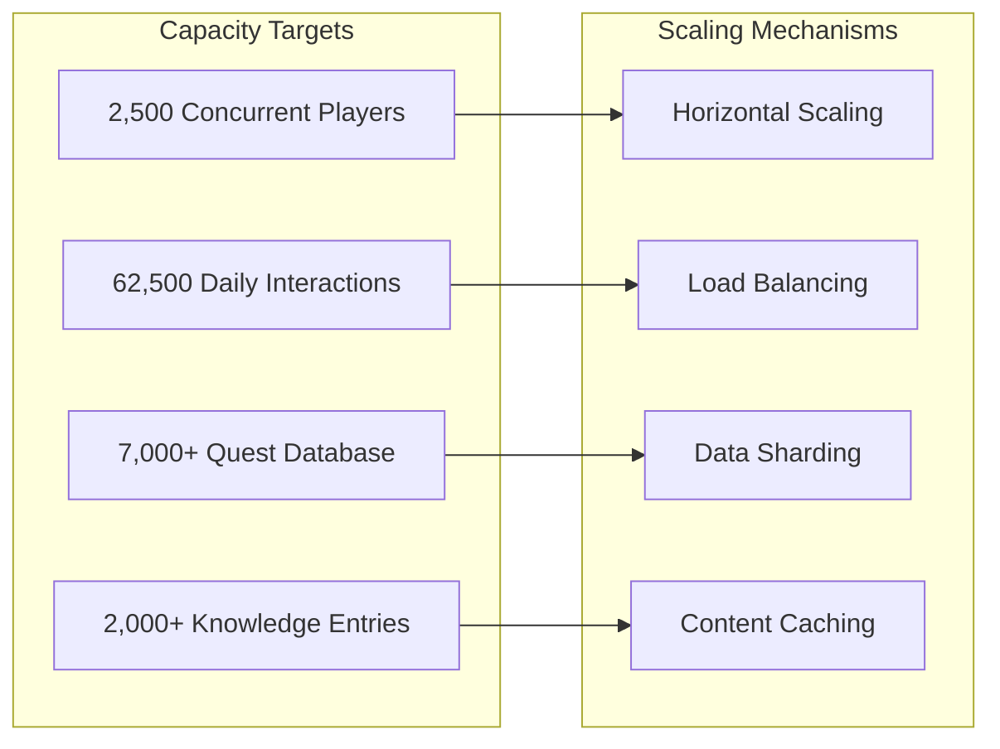

## Security Architecture

### Consensus Mechanism

```mermaid
graph TB
    subgraph "P2P Consensus"
        BN[Bootstrap Nodes (5 min)]
        HN[Honest Nodes (67% req)]
        BFT[Byzantine Fault Tolerance]
        CP[Checkpoint Recovery]
    end
    
    subgraph "Validation Layers"
        AV[Action Validation]
        SV[State Validation]
        CV[Content Validation]
        EV[Economic Validation]
    end
    
    BN --> AV
    HN --> SV
    BFT --> CV
    CP --> EV
```

### Authenticity Validation

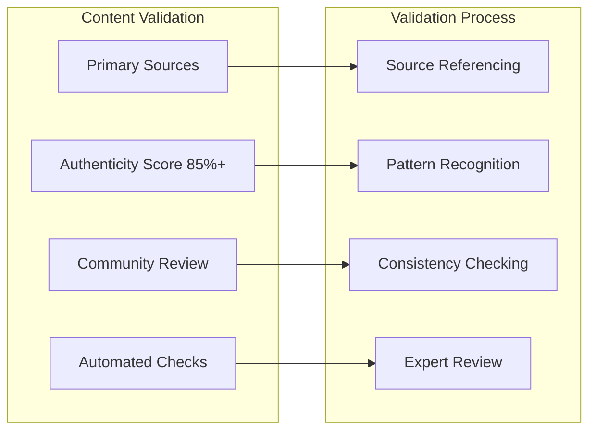

## Autonomous Self-Governance Architecture

### Core Autonomous Systems

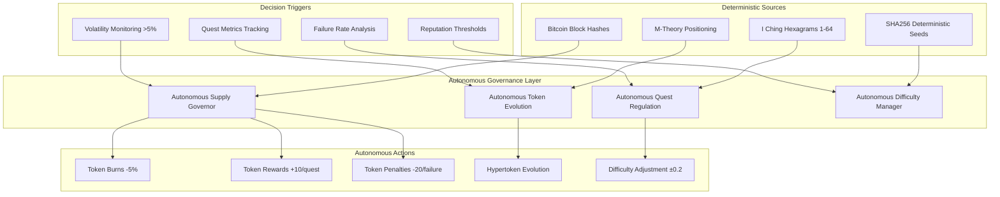

### Autonomous Governance Principles

1. **Self-Regulation**: Systems monitor internal metrics and auto-adjust via deterministic rules
2. **Rule-Based Execution**: Predefined thresholds trigger actions using Bitcoin block hashes for randomness
3. **Immutability & Transparency**: All rules inscribed on Bitcoin L1 via Ordinals for permanent enforcement
4. **Mystical Integration**: Governance echoes Enochian hierarchies and Gnostic self-knowledge
5. **Zero Maintenance**: Enables perpetual operation without human intervention

### Implementation Components

- **Autonomous Supply Governor**: `/core/governance/autonomous_governance.rs`
- **Self-Governing Token Evolution**: `/core/onchain/tap_integration.rs`
- **Autonomous Quest Difficulty**: `/engines/storyline_generation/core/quest_generator.rs`
- **Deterministic Randomness**: Bitcoin block hashes for I Ching hexagram generation

---

*This system architecture provides the complete technical foundation for the Enochian Cyphers Story Engine, ensuring scalability, authenticity, autonomous governance, and Bitcoin L1 compliance across all components.*
