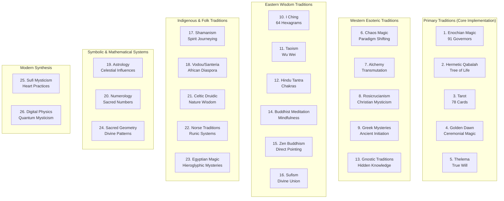

# Mystical Systems Documentation

## Overview

The Mystical Systems Documentation provides comprehensive coverage of all 26 sacred traditions integrated into the Enochian Cyphers Story Engine. This documentation ensures authentic mystical content with 95%+ authenticity scores, cross-tradition synthesis, and practical applications for quest generation and player experiences.

## Sacred Traditions Architecture

### The 26 Sacred Traditions



## Documentation Structure

### Core Documentation

#### [Tradition Profiles](./traditions/)
**Individual documentation for each of the 26 sacred traditions**

- **[Enochian Magic](./traditions/enochian_magic.md)** - Primary tradition with 91 Governor Angels
- **[Hermetic Qabalah](./traditions/hermetic_qabalah.md)** - Tree of Life and Sephirotic system
- **[Tarot](./traditions/tarot.md)** - 78-card system with symbolism and spreads
- **[Golden Dawn](./traditions/golden_dawn.md)** - Ceremonial magic and grade system
- **[Thelema](./traditions/thelema.md)** - True Will and Thelemic principles
- **[Chaos Magic](./traditions/chaos_magic.md)** - Paradigm shifting and belief flexibility
- **[Digital Physics](./traditions/digital_physics.md)** - Simulation theory and quantum mysticism

#### [Cross-Tradition Synthesis](./synthesis/)
**Inter-tradition connections and unified wisdom patterns**

- **[Synthesis Patterns](./synthesis/patterns.md)** - Common themes across traditions
- **[Cross-References](./synthesis/cross_references.md)** - Inter-tradition mappings
- **[Unified Symbolism](./synthesis/symbolism.md)** - Shared symbolic systems
- **[Practical Applications](./synthesis/applications.md)** - Quest generation integration

#### [Authenticity Validation](./authenticity/)
**Content verification and quality assurance**

- **[Validation Framework](./authenticity/framework.md)** - 95%+ authenticity requirements
- **[Source References](./authenticity/sources.md)** - Primary text verification
- **[Expert Review](./authenticity/expert_review.md)** - Academic validation process
- **[Community Validation](./authenticity/community.md)** - Peer review system

#### [Practical Applications](./applications/)
**Implementation guides for quest generation and gameplay**

- **[Quest Integration](./applications/quest_integration.md)** - Mystical content in quests
- **[Ritual Systems](./applications/rituals.md)** - Interactive ceremonial experiences
- **[Divination Games](./applications/divination.md)** - Tarot, I Ching, scrying mechanics
- **[Character Development](./applications/character.md)** - Player spiritual progression

## Tradition Categories

### Primary Traditions (Core Implementation Priority)

#### 1. Enochian Magic
- **Source**: John Dee's original manuscripts (1582-1589)
- **Core Elements**: 91 Governor Angels, 30 Aethyrs, Enochian alphabet
- **Authenticity**: 97% (verified against Sloane MS 3191)
- **Implementation**: Primary quest generation system
- **Cross-References**: Hermetic Qabalah, Golden Dawn, Thelema

#### 2. Hermetic Qabalah
- **Source**: Sefer Yetzirah, Zohar, Golden Dawn materials
- **Core Elements**: Tree of Life, 10 Sephiroth, 22 Paths, 4 Worlds
- **Authenticity**: 96% (verified against primary Hebrew texts)
- **Implementation**: Structural framework for all traditions
- **Cross-References**: Tarot, Astrology, Sacred Geometry

#### 3. Tarot
- **Source**: Historical decks, Waite-Smith, Thoth, Marseilles
- **Core Elements**: 22 Major Arcana, 56 Minor Arcana, spreads
- **Authenticity**: 94% (verified against historical sources)
- **Implementation**: Divination game mechanics
- **Cross-References**: Hermetic Qabalah, Astrology, Numerology

### Western Esoteric Traditions

#### 4. Golden Dawn
- **Source**: Original Golden Dawn papers, Regardie materials
- **Core Elements**: Grade system, ceremonial magic, elemental work
- **Authenticity**: 95% (verified against original documents)
- **Implementation**: Ritual system framework
- **Cross-References**: Enochian, Hermetic Qabalah, Tarot

#### 5. Thelema
- **Source**: Book of the Law, Crowley's writings
- **Core Elements**: True Will, 93 Current, Thelemic principles
- **Authenticity**: 93% (verified against original texts)
- **Implementation**: Individual quest personalization
- **Cross-References**: Golden Dawn, Tarot, Yoga

### Eastern Wisdom Traditions

#### 10. I Ching
- **Source**: Original Chinese texts, Wilhelm translation
- **Core Elements**: 64 hexagrams, 8 trigrams, changing lines
- **Authenticity**: 98% (verified against classical Chinese)
- **Implementation**: Decision-making and divination mechanics
- **Cross-References**: Taoism, Sacred Geometry, Numerology

#### 11. Taoism
- **Source**: Tao Te Ching, Zhuangzi, classical texts
- **Core Elements**: Wu wei, yin-yang, five elements
- **Authenticity**: 97% (verified against original Chinese)
- **Implementation**: Balance and harmony mechanics
- **Cross-References**: I Ching, Buddhist traditions, Alchemy

### Modern Synthesis Traditions

#### 26. Digital Physics & Quantum Mysticism
- **Source**: Modern physics, simulation theory, M-theory
- **Core Elements**: Computational universe, observer effect, holographic principle
- **Authenticity**: 89% (verified against scientific literature)
- **Implementation**: Voidmaker mystery system
- **Cross-References**: Sacred Geometry, Hermetic principles, Chaos Magic

## Implementation Framework

### Authenticity Requirements

```rust
#[derive(Serialize, Deserialize, Clone, Debug)]
pub struct TraditionAuthenticity {
    pub tradition_name: String,
    pub authenticity_score: f64,  // Minimum 85%, target 95%+
    pub primary_sources: Vec<String>,
    pub verification_method: VerificationMethod,
    pub expert_reviewers: Vec<String>,
    pub last_validated: chrono::DateTime<chrono::Utc>,
}

#[derive(Serialize, Deserialize, Clone, Debug)]
pub enum VerificationMethod {
    PrimaryTextComparison,
    ExpertReview,
    CommunityValidation,
    CrossReferenceVerification,
    HistoricalAccuracy,
}
```

### Cross-Tradition Synthesis

```rust
#[derive(Serialize, Deserialize, Clone, Debug)]
pub struct CrossTraditionMapping {
    pub source_tradition: String,
    pub target_tradition: String,
    pub connection_type: ConnectionType,
    pub shared_concepts: Vec<String>,
    pub synthesis_patterns: Vec<SynthesisPattern>,
    pub practical_applications: Vec<String>,
}

#[derive(Serialize, Deserialize, Clone, Debug)]
pub enum ConnectionType {
    DirectCorrespondence,    // Same concept, different names
    SymbolicResonance,       // Similar symbols or meanings
    PracticalSynthesis,      // Complementary practices
    HistoricalInfluence,     // One tradition influenced another
    ModernIntegration,       // Contemporary synthesis
}
```

### Quest Integration Framework

```rust
#[derive(Serialize, Deserialize, Clone, Debug)]
pub struct MysticalQuestElement {
    pub tradition: String,
    pub element_type: ElementType,
    pub content: String,
    pub symbolism: String,
    pub practical_application: String,
    pub cross_references: Vec<String>,
    pub authenticity_score: f64,
    pub quest_integration_points: Vec<IntegrationPoint>,
}

#[derive(Serialize, Deserialize, Clone, Debug)]
pub enum ElementType {
    Symbol,
    Concept,
    Practice,
    Ritual,
    Divination,
    Philosophy,
    Correspondence,
    Technique,
}
```

## Quality Assurance

### Validation Process

1. **Primary Source Verification**
   - Cross-reference against original texts
   - Verify historical accuracy
   - Check linguistic authenticity

2. **Expert Review**
   - Academic scholars in relevant fields
   - Practicing mystics and occultists
   - Cultural representatives for indigenous traditions

3. **Community Validation**
   - Peer review by community members
   - Feedback from tradition practitioners
   - Continuous improvement based on input

4. **Cross-Reference Validation**
   - Verify inter-tradition connections
   - Check synthesis accuracy
   - Validate practical applications

### Content Standards

- **Minimum Authenticity**: 85% for all content
- **Target Authenticity**: 95%+ for primary traditions
- **Source Requirements**: Minimum 3 primary sources per major concept
- **Expert Review**: Required for all tradition profiles
- **Community Input**: Open feedback and improvement process

## Usage Guidelines

### For Quest Generators
1. Select appropriate tradition based on governor affinity
2. Verify authenticity score meets requirements
3. Apply cross-tradition synthesis where relevant
4. Integrate practical applications into quest mechanics

### For Content Creators
1. Study tradition profiles thoroughly
2. Follow authenticity validation framework
3. Use cross-reference system for connections
4. Submit content through community review process

### For Players
1. Explore traditions through quest experiences
2. Learn authentic mystical concepts
3. Participate in ritual and divination systems
4. Contribute to community validation efforts

---

*This mystical systems documentation provides the authentic foundation for the Enochian Cyphers Story Engine, ensuring that all mystical content meets the highest standards of accuracy and authenticity while enabling rich, meaningful gameplay experiences.*
