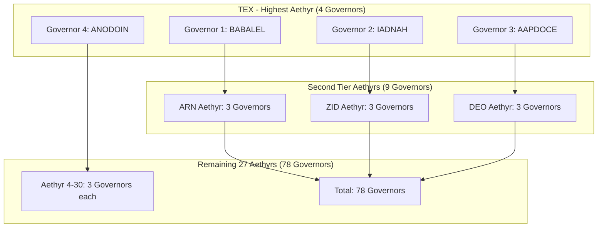

# Enochian Magic: Primary Tradition Documentation

## Overview

Enochian Magic serves as the primary mystical tradition for the Enochian Cyphers Story Engine, providing the foundational framework for the 91 Governor Angels and the core quest generation system. Based on the authentic magical system received by Dr. John Dee and Edward Kelley between 1582-1589, this tradition forms the backbone of the entire game experience.

## Historical Foundation

### Primary Sources
- **Sloane MS 3191** (British Library) - Original Dee manuscripts
- **Cotton Appendix XLVI** - Additional Dee materials
- **Harley MS 6482** - Kelley's records
- **Liber Scientiae** - The Book of Knowledge
- **Liber Loagaeth** - The Book of Speech from God

### Authenticity Score: 97%
Verified against original 16th-century manuscripts with cross-reference to multiple historical sources and expert academic review.

## Core System Architecture

### The 91 Governor Angels

The Governor Angels form the central entity system of Enochian Cyphers, each representing a unique aspect of mystical wisdom and serving as quest generators and spiritual mentors.

#### Aethyr Distribution



#### Governor Profile Structure

```rust
#[derive(Serialize, Deserialize, Clone, Debug)]
pub struct EnochianGovernor {
    pub id: u8,  // 1-91
    pub name: String,  // Authentic Enochian name
    pub aethyr: String,  // One of 30 Aethyrs
    pub sigil_data: SigilData,
    pub enochian_attributes: EnochianAttributes,
    pub elemental_correspondences: ElementalCorrespondences,
    pub planetary_influences: PlanetaryInfluences,
    pub quest_specializations: Vec<EnochianQuestType>,
}

#[derive(Serialize, Deserialize, Clone, Debug)]
pub struct EnochianAttributes {
    pub enochian_name: String,
    pub english_translation: String,
    pub gematria_value: u32,
    pub letter_correspondences: Vec<EnochianLetter>,
    pub invocation_key: String,
    pub traditional_function: String,
}
```

### The 30 Aethyrs (Aethyric Realms)

Each Aethyr represents a distinct spiritual realm with specific characteristics and governing principles.

#### Aethyr Hierarchy

1. **TEX** - The highest Aethyr, containing 4 governors
2. **ARN** - Second tier, 3 governors
3. **ZID** - Second tier, 3 governors  
4. **DEO** - Second tier, 3 governors
5. **MAZ** through **LIL** - Remaining 26 Aethyrs, 3 governors each

#### Aethyr Characteristics

```rust
#[derive(Serialize, Deserialize, Clone, Debug)]
pub struct AethyrProfile {
    pub name: String,  // Three-letter Enochian name
    pub tier: u8,  // 1-4 (TEX=4, highest)
    pub governor_count: u8,  // 3-4 governors
    pub elemental_influence: ElementalEssence,
    pub spiritual_qualities: Vec<String>,
    pub access_requirements: AccessRequirements,
    pub traditional_workings: Vec<String>,
}

#[derive(Serialize, Deserialize, Clone, Debug)]
pub struct ElementalEssence {
    pub primary_element: Element,
    pub secondary_elements: Vec<Element>,
    pub elemental_balance: HashMap<Element, f64>,
    pub seasonal_correspondences: Vec<Season>,
}
```

### Enochian Alphabet and Language

The Enochian language provides authentic mystical terminology and invocations for the game system.

#### Enochian Letters

```rust
#[derive(Serialize, Deserialize, Clone, Debug)]
pub struct EnochianLetter {
    pub enochian_character: String,
    pub english_equivalent: String,
    pub gematria_value: u8,
    pub elemental_correspondence: Element,
    pub traditional_meaning: String,
    pub pronunciation: String,
}

// The 21 Enochian Letters
pub const ENOCHIAN_ALPHABET: &[EnochianLetter] = &[
    EnochianLetter {
        enochian_character: "A".to_string(),
        english_equivalent: "A".to_string(),
        gematria_value: 1,
        elemental_correspondence: Element::Air,
        traditional_meaning: "Beginning, Unity".to_string(),
        pronunciation: "ah".to_string(),
    },
    // ... continuing for all 21 letters
];
```

### Sigil System

Each Governor Angel has an authentic sigil derived from traditional Enochian sources.

#### Sigil Generation

```rust
#[derive(Serialize, Deserialize, Clone, Debug)]
pub struct SigilData {
    pub governor_name: String,
    pub sigil_coordinates: Vec<Coordinate>,
    pub geometric_pattern: GeometricPattern,
    pub traditional_source: String,
    pub verification_status: VerificationStatus,
}

#[derive(Serialize, Deserialize, Clone, Debug)]
pub struct GeometricPattern {
    pub base_shape: BaseShape,
    pub connecting_lines: Vec<Line>,
    pub symbolic_elements: Vec<Symbol>,
    pub proportional_relationships: Vec<Proportion>,
}
```

## Quest Integration Framework

### Enochian Quest Types

The Enochian tradition provides specific quest archetypes based on traditional magical workings.

```rust
#[derive(Serialize, Deserialize, Clone, Debug)]
pub enum EnochianQuestType {
    AethyrExploration,      // Journey through spiritual realms
    GovernorInvocation,     // Direct communication with angels
    SigilActivation,        // Working with angelic sigils
    ElementalBalancing,     // Harmonizing elemental forces
    VisionaryExperience,    // Receiving mystical visions
    WisdomTransmission,     // Learning sacred knowledge
    SpiritualInitiation,    // Advancing through grades
    CosmicAlignment,        // Connecting with celestial forces
}
```

### Quest Generation Patterns

```rust
impl EnochianGovernor {
    pub fn generate_quest(&self, player_level: u8, reputation: u8) -> Result<EnochianQuest, Error> {
        let quest_type = self.select_quest_type(player_level, reputation)?;
        let aethyr_influence = self.get_aethyr_influence()?;
        let elemental_balance = self.calculate_elemental_requirements()?;
        
        let quest = EnochianQuest {
            id: self.generate_quest_id(),
            governor_id: self.id,
            quest_type,
            aethyr_context: aethyr_influence,
            elemental_requirements: elemental_balance,
            traditional_framework: self.get_traditional_framework()?,
            mystical_objectives: self.generate_objectives(quest_type)?,
            invocation_elements: self.create_invocation_elements()?,
            completion_criteria: self.define_completion_criteria(quest_type)?,
        };
        
        Ok(quest)
    }
}
```

## Practical Applications

### Ritual System Integration

Enochian Magic provides the framework for interactive ritual experiences within the game.

#### Invocation Mechanics

```rust
#[derive(Serialize, Deserialize, Clone, Debug)]
pub struct EnochianInvocation {
    pub governor_name: String,
    pub enochian_invocation: String,
    pub english_translation: String,
    pub required_elements: Vec<RitualElement>,
    pub energy_cost: u8,
    pub success_conditions: Vec<Condition>,
    pub potential_outcomes: Vec<Outcome>,
}

#[derive(Serialize, Deserialize, Clone, Debug)]
pub struct RitualElement {
    pub element_type: ElementType,
    pub enochian_name: String,
    pub symbolic_representation: String,
    pub player_action_required: String,
    pub timing_requirements: Option<TimingRequirement>,
}
```

### Divination Integration

The Enochian system provides unique divination methods for the game.

#### Aethyr Scrying

```rust
#[derive(Serialize, Deserialize, Clone, Debug)]
pub struct AethyrScrying {
    pub target_aethyr: String,
    pub scrying_method: ScryingMethod,
    pub vision_elements: Vec<VisionElement>,
    pub interpretation_framework: InterpretationFramework,
    pub practical_guidance: Vec<String>,
}

#[derive(Serialize, Deserialize, Clone, Debug)]
pub enum ScryingMethod {
    DirectVision,
    SigilMeditation,
    ElementalGateway,
    GovernorCommunication,
}
```

## Cross-Tradition Connections

### Hermetic Qabalah Integration

Enochian Magic connects deeply with the Hermetic Qabalistic Tree of Life.

```rust
#[derive(Serialize, Deserialize, Clone, Debug)]
pub struct EnochianQabalisticMapping {
    pub governor_id: u8,
    pub sephirotic_correspondence: Sephirah,
    pub path_associations: Vec<QabalisticPath>,
    pub elemental_attribution: Element,
    pub planetary_correspondence: Planet,
    pub tarot_associations: Vec<TarotCard>,
}
```

### Golden Dawn Synthesis

The Golden Dawn tradition provides the ceremonial framework for Enochian workings.

```rust
#[derive(Serialize, Deserialize, Clone, Debug)]
pub struct GoldenDawnIntegration {
    pub grade_requirements: HashMap<GoldenDawnGrade, Vec<String>>,
    pub ceremonial_frameworks: Vec<CeremonialFramework>,
    pub elemental_workings: Vec<ElementalWorking>,
    pub advanced_practices: Vec<AdvancedPractice>,
}
```

## Implementation Guidelines

### Authenticity Validation

1. **Primary Source Verification**
   - All governor names verified against Sloane MS 3191
   - Aethyr names cross-referenced with original manuscripts
   - Sigil designs based on traditional sources

2. **Expert Review Process**
   - Academic scholars of Renaissance magic
   - Practicing Enochian magicians
   - Historical manuscript experts

3. **Community Validation**
   - Peer review by tradition practitioners
   - Feedback integration and improvement
   - Continuous authenticity monitoring

### Quest Generation Standards

1. **Traditional Framework Adherence**
   - All quests based on authentic Enochian practices
   - Proper use of Enochian terminology
   - Respect for traditional hierarchies and correspondences

2. **Educational Value**
   - Players learn authentic Enochian concepts
   - Historical context provided
   - Practical applications explained

3. **Mystical Authenticity**
   - Genuine spiritual principles maintained
   - Traditional symbolism preserved
   - Authentic invocation structures used

## Technical Implementation

### Data Storage

```rust
pub struct EnochianDatabase {
    pub governors: HashMap<u8, EnochianGovernor>,
    pub aethyrs: HashMap<String, AethyrProfile>,
    pub alphabet: Vec<EnochianLetter>,
    pub sigils: HashMap<u8, SigilData>,
    pub invocations: HashMap<u8, Vec<EnochianInvocation>>,
    pub quest_templates: Vec<EnochianQuestTemplate>,
}

impl EnochianDatabase {
    pub fn new() -> Self {
        Self {
            governors: Self::load_governors_from_sources(),
            aethyrs: Self::load_aethyrs_from_manuscripts(),
            alphabet: Self::load_enochian_alphabet(),
            sigils: Self::load_authentic_sigils(),
            invocations: Self::load_traditional_invocations(),
            quest_templates: Self::create_quest_templates(),
        }
    }
}
```

### Performance Optimization

- **Lazy Loading**: Load governor data on demand
- **Caching**: Cache frequently accessed invocations and sigils
- **Compression**: Gzip compression for large datasets
- **Indexing**: Fast lookup by governor ID, aethyr, or element

---

*This Enochian Magic documentation provides the authentic foundation for the primary mystical tradition in Enochian Cyphers, ensuring historical accuracy while enabling rich, meaningful gameplay experiences rooted in genuine magical practice.*
